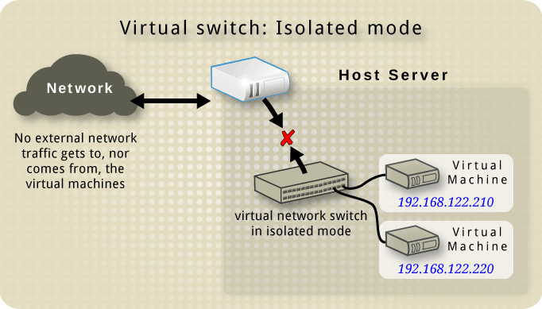

## Tipos de Redes

### Redes privadas basadas en NAT


Podemos definir este tipo de red en un fichero xml de la siguiente manera:

```xml
<network>
  <name>default</name>
  <bridge name="virbr0"/>
  <forward mode="nat"/>
  <ip address="192.168.122.1" netmask="255.255.255.0">
    <dhcp>
      <range start="192.168.122.2" end="192.168.122.254"/>
    </dhcp>
  </ip>
</network>
```

Se creará un dispositivo switch virtual llamado `virbr0`. A este dispositivo estará conecto el host con la dirección `192.168.122.1`. A este switch se iran conectando las máquinas virtuales que esten conectada a esta red. El host tendrá un proceso `dnsmasq` que hará de servidor dhcp y servidor dns para las mv.

La configuración dhcp es optativa, podemos crear un red NAT que no tenga configurado un servidor dhcp.

Existen la redes de tipo [router](https://wiki.libvirt.org/page/VirtualNetworking#Routed_mode) cuya funcionalidad es la misma que las redes NAT, dan acceso a las máquinas virtuales al exterior, pero en ese caso no se utiliza el mecanismo de NAT, sino que se usan rutas de encaminamiento en el host.

### Redes privadas aisladas (isolated)



En este caso las máquinas virtuales no tienen acceso al exterior. La definición es la misma pero hemos quitado el `forward mode`.

```xml
<network>
  <name>private</name>
  <bridge name="virbr2"/>
  <ip address="192.168.152.1" netmask="255.255.255.0">
    <dhcp>
      <range start="192.168.152.2" end="192.168.152.254"/>
    </dhcp>
  </ip>
</network>
```

Las máquinas virtuales y el host están conectados al switch `virbr2`. Existe un servidor dhcp en el host que configura las máquinas virtuales no tienen acceso al exterior.

Si no indicamos la ip con al que se conecta el host y la configuración del servidor dhcp, definiremos una red privada aislada donde se conectan las máquinas virtuales pero a la que no está conectada el host. En este caso tendremos que utilizar direccionamiento estático para configurar la red de las máquinas virtuales.

```xml
<network>
  <name>private</name>
  <bridge name="virbr2"/>
</network>
```

### Redes públicas conectadas a un bridge externo

En este caso necesitamos crear un switch/bridge virtual al que conectaremos la máquina física y las máquinas virtuales. En este caso las máquinas virtuales estarán en la misma red red que el host y estaran conectadas directamente al router de esta red, tomando la configuración dhcp (si la hubiera) del mismo modo que la toma el host.

Para [crear un switch virtual](https://wiki.debian.org/BridgeNetworkConnections) vamos a usar la utilidad `brctl` del paquete `bridge-utils`. A este dispositivo lo podemos llamar `br0` y en él conectaremos la interfaz física del host. Posteriormente crearemos una red con libvirt de la siguiente manera:

```xml
<network>
  <name>host-bridge</name>
  <forward mode="bridge"/>
  <bridge name="br0"/>
</network>
```

### Redes públicas usando una conexión macvtap

En este caso vamos a usar una conexión macvtap, que nos permite conectarnos a la red física directamente a través de una interfaz física del host (sin usar un dispositivo bridge). Al igual que con la red anterior, las máquinas virtuales estarán conectados directamente a la red física, por lo que sus direcciones IP estarán todas en la subred de la red física. Existe una una limitación en la implementación de macvtap: estas conexiones no permiten la comunicación directa entre el host y los invitados.

La definición de este tipo de red sería la siguiente:

```xml
<network>
  <name>direct-macvtap</name>
  <forward mode="bridge">
    <interface dev="eth0"/>
  </forward>
</network>
```

En este caso el interfaz físico usado en el host es `eth0`.

## Configuración de red en las máquina virtuales

Al crear una máquina virtual con `virt-install`podemos indicar la conexión a una o varias redes:

```
virt-install --network network=default --network network=default2 ...
```

Si la máquina virtual está ejecutándose tenemos dos opciones:

1. Editar la configuración con `virsh edit`, añadir una sección `interface` y reiniciar la máquina.

    ```xml
    <interface type="network">
        <source network="default"/>
    </interface>
    ```

2. Usar `virsh attach-interface`:

    Si tenemos una máquina virtual llamada `ejemplo1` conectada a la red `default` y queremos añadir una interfaz a la red `aislada`, ejecutamos:

    ```bash
    virsh -c qemu:///system attach-interface ejemplo network aislada
    ```