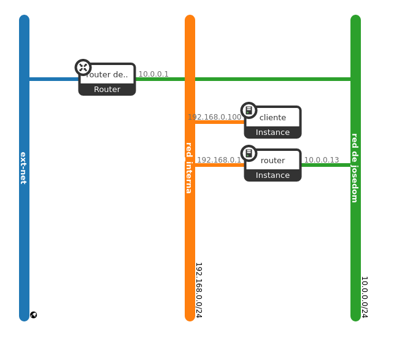

Vamos a crear la siguiente infraestructura:

Con las siguientes características:

* Crea una red que se debe llamar "red_interna", con direccionamiento 192.168.0.0/24, tendrá el DHCP activado, el gateway será el 192.168.0.1 y el DNS que reparte el 192.168.202.2.
* Crea una instancia a partir de una imagen, llamada `router` conecta a tu red y a la red "red_interna" en la dirección 192.168.0.1. Esta máquina será la puerta de enlace del la otra máquina.
* Crea otra instancia a partir de un volumen, que se llame `cliente` y que tenga la ip 192.168.0.100, evidentemente conectada a la red_interna.

Configura una IP flotante a la instancia `router`. ¿Puedes asociar una IP flotante a la máquina `cliente`? ¿Por qué?. ¿Cómo accederás a la segunda máquina?. ¿La máquina `cliente` tiene internet?

Configura la instancia `router` para que haga router-nat y podamos tener conexión al exterior en la máquina `cliente`.

Openstack nos ofrece los grupos de seguridad que es un cortafuego que permite controlar el tráfico saliente y entrante en cada nodo de una instancia, además este cortafuego  aplica reglas **anti-spoofing** a todos los puertos para garantizar que el tráfico inesperado o no deseado no pueda originarse o pasar a través de un puerto. Esto incluye reglas que prohíben que las instancias actúen como servidores DHCP, actúen como enrutadores u obtengan tráfico de una dirección IP que no sea su IP fija. Para solucionar esta limitación, nosotros vamos a desactivar las reglas de seguridad en las instancias, para ello:

* En cada instancia edita los grupos de seguridad y quita el grupo de seguridad default. en este momento la instancia no admite ningún tráfico.
* Para cada interface (puerto) de las instancias implicadas (en nuestro caso 3 puertos) tenemos que deshabilitar la seguridad del puerto. en este momento ya no tenemos cortafuegos en las instancias.


**Entrega**

1. Una captura de pantalla a tu topología de red con el escenario montado.
2. Capturas de pantalla donde se vea que las instancia no tienen grupo de seguridad y que los en los puertos se han deshabilitado la seguridad.
3. Una prueba de funcionamiento que el cliente tiene resolución dns y conexión al exterior.

{{ notice-text | markdownify }}
