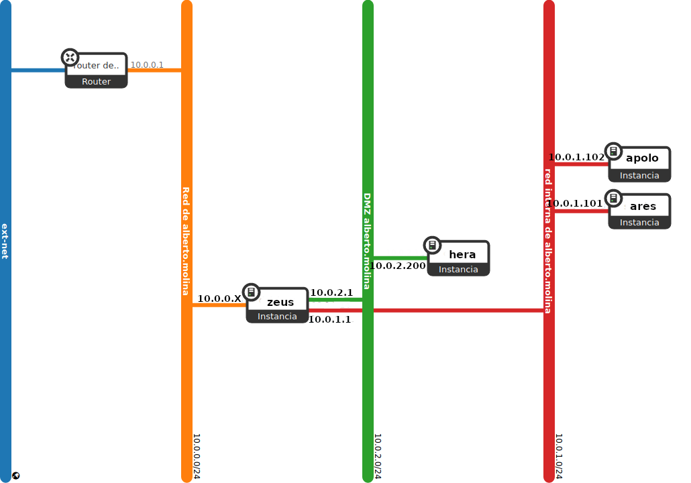

En esta tarea se va a crear el escenario de trabajo que se va a usar durante todo el curso, que va a constar inicialmente de 4 instancias con nombres relacionados con los dioses griegos.

Pasos a realizar:

1. Creación de la red interna:
    * Nombre: "red interna de <nombre de usuario>"
    * Direccionamiento: 10.0.1.0/24
    * DHCP y DNS (192.168.202.2)
2. Creación de la red DMZ:
    * Nombre: "red DMZ de <nombre de usuario>"
    * Direccionamiento: 172.16.0.0/16
    * DHCP y DNS (192.168.202.2)
3. Creación de las instancias
    * Máquina 1 (zeus)
        * Debian 11 sobre volumen de 10GB con un sabor de tipo mini.
        * Accesible directamente a través de la red externa y con una IP flotante
        * Conectada a la red interna y a la red DMZ, de la que será la puerta de enlace (10.0.1.1, y 172.16.0.1)
    * Máquina 2 (ares)
        * Ubuntu 20.04 sobre volumen de 10GB con un sabor de tipo mini.
        * Conectada a la red interna
        * Dirección: 10.0.1.101
        * Accesible indirectamente a través de zeus
    * Máquina 3 (apolo)
        * Debian 11 sobre volumen de 10GB con un sabor de tipo mini.
        * Conectada a la red interna
        * Dirección: 10.0.1.102
        * Accesible indirectamente a través de zeus
    * Máquina 4 (hera)
        * Rocky 8 sobre volumen de 10GB con un sabor de tipo mini.
        * Conectada a la red DMZ
        * Dirección: 172.16.0.200
        * Accesible indirectamente a través de zeus
4. Deshabilita la seguridad en todos los puertos de las instancias.
5. Configuración de NAT en zeus.
6. Definición de contraseña en todas las instancias (para poder modificarla desde consola en caso necesario).
7. Configuración de ssh en tu cliente para acceder a todas las instancias.
8. Creación del usuario `profesor` en todas las instancias. Usuario que puede utilizar `sudo` sin contraseña.
9. Copia de las claves públicas de todos los profesores en las instancias para que puedan acceder con el usuario `profesor`.
10. Realiza una actualización completa de todos los servidores.
11. El dominio utilizado sera del tipo `tunombre.gonzalonazareno.org`.
12. Nombrar de forma adecuada: FQDN todas las máquinas. Hacerlo con el `cloud-init` y un fichero `cloud-config.yaml`. Puedes configurar en este fichero algunos puntos anteriores (el 6, el 8, el 9, el 10,...)
13. Hasta que no esté configurado el servidor DNS, incluye resolución estática en las cuatro instancias tanto usando nombre completo como hostname.
    
La creación y configuración (conexión a las redes, creación de volumen, quitarle la seguridad, ...) de la máquina 1 la debes hacer con OSC. Lo demás lo puedes hacer con horizon.


## Entrega...

* Las instrucciones para crear y configurar la máquina 1.
* Los ficheros `cloud-config.yaml` utilizados en la creación de las máquinas.
* La IP flotantes de zeus.


{{ notice-text | markdownify }}

