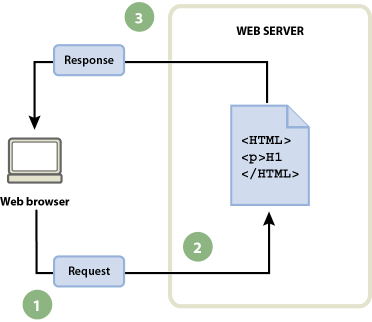

Después de buscar información sobre la web, y la diferencias entre las páginas web estática y dinámica, responde las siguientes preguntas:

1. Define algunos conceptos relacionados con la web: aplicación web, http, html, navegador web, servidor web, servidor de aplicaciones.

2. ¿Qué diferencias hay entre aplicaciones web estáticas y dinámicas? Qué ventajas e inconvenientes tienen cada una de ellas.

3. Nombra los lenguajes de programación que nos permiten crear aplicaciones web dinámicas. Indica que lenguajes de programación se ejecutan en el servidor y cuáles se ejecutan en el cliente.

4. ¿Qué es un CMS?. ¿Qué tipos de CMS existen?. Pon algunos ejemplos e indica en que lenguaje de programación están realizados.

5. Tienes que entender cómo se procesa una página web estática:

    

6. Tienes que entender cómo se procesa una página web dinámica:

    

7. Tienes que entender cómo se procesa una página web dinámica con acceso a la base de datos:

    