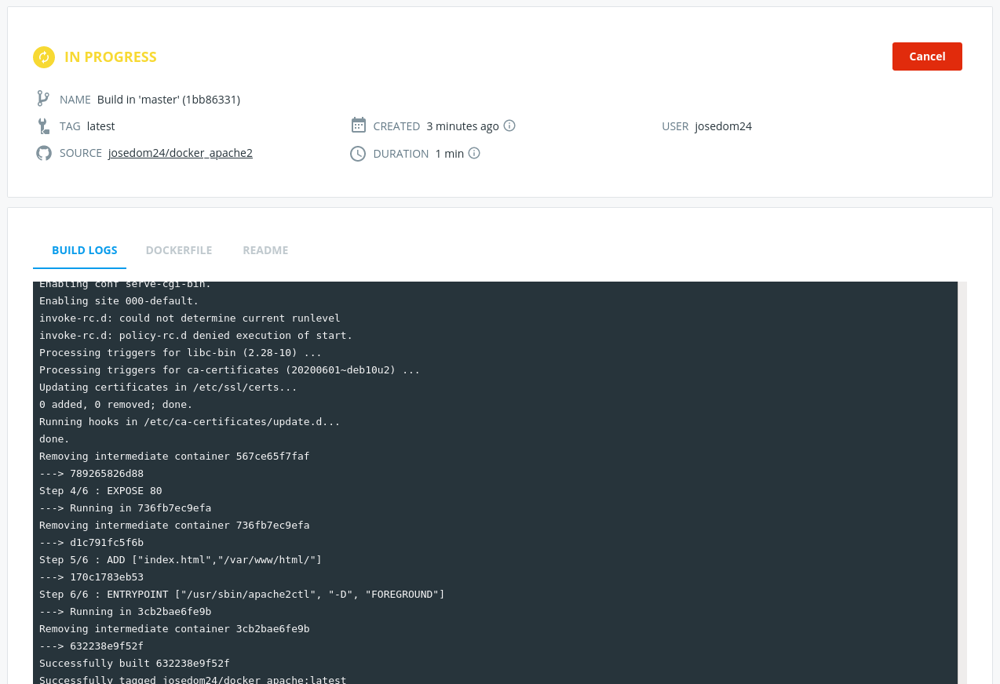

La página Docker Hub nos ofrece un sistema de integración continúa para la creación automática de imágenes. Lo que vamos a hacer es conectar nuestro repositorio de DockerHub con un repositorio de GitHub, donde tengamos el contexto para la construcción de la imagén (`Dcokerfile` y ficheros necesarios). Los pasos serán:

1. Crear un nuevo repositorio en Docker Hub: Ponemos un nombre. 

    

2. En la sección `Build` del repositorio conectamos a un repositorio GitHub con el contexto. (Nota: Se añadirá una clave pública en github para que Docker Hub pueda acceder a tus repositorios).

    

3. Cada vez que hagamos un psuh en el repositorio GitHub se creará un nuevo *build* y se creará una nueva imagen.

    