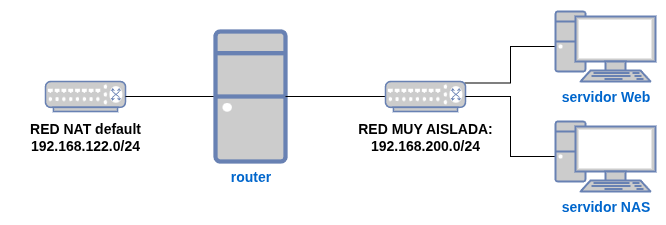

## Objetivos del proyecto

* Crear un escenario virtualizado con QEMU/KVM + libvirt en un servidor sin entorno gráfico.
* Practicar las distintas operaciones sobre los recursos virtualizados que hemos aprendido en esta unidad.
* Vamos a crear una infraestructura con un servidor web que sirva el contenido estático desde un directorio compartido por un servidor NAS.

Se deberá entregar un documento pdf con la documentación donde se expliquen las operaciones realizadas. El documento tendrá al menos los siguientes apartados:

1. Título
2. Índice
3. Introducción
4. Instalación de QEMU / KVM + libvirt
5. Creación y configuración de la infraestructura
6. Instalación de servicios
7. Otras operaciones
8. Comprobaciones finales

Tienes que tener en cuenta:

* Puedes poner más apartados o cambiar los nombres que yo he puesto.
* Los apartados pueden tener subapartdos.
* Los apartados y subapartados deben estar numerados.
* El índice debe ser autogenerado.
* Todo el código debe tener una fuente monoespaciada.

## Entorno de trabajo

La práctica la vamos a realizar en una instancia de OpenStack. Elige el sabor `m1.kvm` para crear dicha instancia. En esa instancia instalaremos QEMU/KVM + libvirt.

Dado que OpenStack suele operar sobre redes encapsuladas (por ejemplo, con VXLAN o GRE), el tamaño efectivo de las tramas se reduce. Cuando usamos una instancia de OpenStack como servidor de virtualización, es necesario ajustar el tamaño máximo de los paquetes de red (**MTU**) para que coincida con el de la red del entorno. Configurar la red de **libvirt** con un **MTU de 1442** evita problemas de comunicación entre las máquinas virtuales, garantizando que los paquetes se transmitan correctamente sin cortes ni errores.

Añade [mi clave pública](https://dit.gonzalonazareno.org/redmine/projects/asir2/wiki/Claves_p%C3%BAblicas_de_los_profesores) a la instancia.

En la documentación sólo tienes que indicar la IP flotante de la instancia.

## Infraestructura que vamos a crear

* Redes que vamos a crear:
	* Debes crear una nueva **red de tipo NAT** `default` con las mismas características que en tu host pero con **MTU de 1442**.
	* Crea una **red muy aislada** `red_intra`, recuerda también configurar de manera adecuada el MTU.
* Máquinas virtuales:
	* `router`:
		* Máquina virtual con Debian 13.
		* Realiza la instalación por red.
		* Está conectada a la red **default** y la **red_intra**.
		* El hostname de esta máquina debe ser `router-tunombre`.
		* Se debe poder acceder a ella por ssh con el usuario `user` sin que te pida contraseña (configura tu clave pública y la mia).
    	* El usuario `user` debe poder ejecutar el comando `sudo` sin que te pida contraseña.
		* Está máquina se debe iniciar cada vez que arrancamos el host.
	* `servidorNAS`:
		* Máquina virtual con Alpine 3.22.
		* Realiza la instalación desde una imagen ISO.
		* Esta máquina debe tener un disco extra de 1Gb que deberás montar en el directorio `/srv/data`.
		* El hostname de esta máquina debe ser `nas-tunombre`.
		* Se debe poder acceder a ella por ssh con el usuario `user` sin que te pida contraseña (configura tu clave pública y la mia).
		* Está máquina se debe iniciar cada vez que arrancamos el host.
	* `servidorWeb`:
		* Máquina virtual Ubuntu 24.04.
		* Crea esta máquina usando clonación enlazada y configuración de cloud-init desde la imagen cloud.
		* El hostname de esta máquina debe ser `web-tunombre`.
		* Se debe poder acceder a ella por ssh con el usuario `user` sin que te pida contraseña (configura tu clave pública y la mia).
		* Está máquina se debe iniciar cada vez que arrancamos el host.
* Configura la máquina **router** para que haga SNAT y permita que las máquinas tengan acceso al exterior (**La configuración debe ser persistente.**). 

## Instalación de servicios

1. Instala el servidor web **nginx** en el `servidorWeb`. 
2. Para que podemos acceder desde el exterior a la página web, vamos a realizar dos configuraciones:
	* Configuramos un proxy inverso en la instancia de OpenStack que envíe todas las peticiones al puerto 80 del `router`.
	* Configuramos el `router` para que podamos acceder al servidor web desde el exterior.
3. Instala en el `servidorNAS` un servidor nfs y comparte el directorio `/srv/data` donde has guardado una página web estática, una plantilla HTML con CSS o la página generada en IAW. En la página principal debe aparecer tu nombre completo y la fecha.
4. Monta en el `servidorWeb` el directorio compartido en `/var/www/data` y crea un Virtual Host que sirva ese sitio web usando el nombre `data.tunombre.org`.

## Otras operaciones

1. El disco donde tenemos la información de la página web en el `servidorNAS` se ha quedado pequeño. Redimensiona el disco y el sistema de ficheros a 2GB-
2. Realiza un snapshot a cada una de las máquinas para que podemos volver a ese estado si tenemos algún problema.

## Comprobaciones finales

Comprueba que el escenario funciona de forma correcta. Muestra en la documentación las comprobaciones que has realizado.
Comprueba lo siguiente: si cambias el contenido de la página web en el `servidorNAS` automáticamente accedemos a la página para comprobar que ha cambiado.