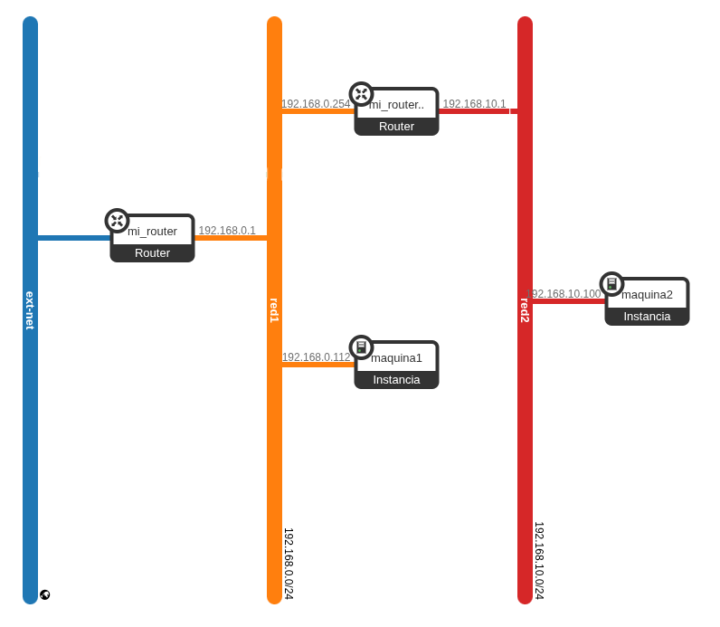

En este apartado vamos a realiza el ejercicio de tener una red interna conectada por un router a un red NAT en Openstack. Realizamos los siguientes pasos:

## Creación de la red NAT

Creamos una nueva red de tipo NAT conectada a un nuevo router:

        openstack router create mi_router
        openstack router set mi_router --external-gateway ext-net

        openstack network create red1
        openstack subnet create --network red1 --subnet-range 192.168.0.0/24 --dns-nameserver 172.22.0.1 subred1

        openstack router add subnet mi_router subred1

A continuación conectamos una instancia a esa red y le asociamos una IP flotante:

        openstack server create --flavor m1.mini \
        --image "Debian 13 Trixie" \
        --security-group default \
        --key-name jdmr \
        --network red1 \
        maquina1

        openstack floating ip create ext-net
        openstack server add floating ip maquina1 172.22.200.50

## Creación de la red interna

Ahora vamos a crear una red interna (red que no estará conectada a un router conectado a la red externa). Podríamos crearlo de dos formas:

* Con servidor DHCP: cloud-init configurará la instancia con direccionamiento dinámico. Podríamos conectar la instancia directamente a la red o usar un puerto para configurar una reserva.
* Sin servidor DHCP: cloud-init configurará la instancia de forma estática, pero necesitará leer la información de un CDROM (`-config-drive True`). Si usamos un puerto, podremos configurar un IP fija estática.

En este caso crearemos una red interna con servidor DHCP:

        openstack network create red2
        openstack subnet create --network red2 --subnet-range 192.168.10.0/24 --dns-nameserver 172.22.0.1 subred2

A continuación, crearemos un router al que vamos a conectar a la red1 y a la red2:

* A la red2 lo conectaremos a la primera dirección de red (`192.168.10.1`), que será la puerta de enlace de las instancias que conectaremos a esta red.
* Las instancias de la red1 tienen su puerta de enlace que es el router anterior con dirección (`192.168.0.1`) por lo que vamos aconectar este nuevo router a la última dirección (`192.168.0.254`).

Para realizar esta configuración:

        openstack router create mi_router2
        
        openstack port create --network red1 --fixed-ip ip-address=192.168.0.254 port_router2
        openstack router add port mi_router2 port_router2

        openstack router add subnet mi_router2 subred2

Y creamos una instancia en esa red, vamos a crear una reserva para que tenga la IP `192.168.10.100`:

        openstack port create --network red2 --fixed-ip ip-address=192.168.10.100 port_maquina2

        openstack server create --flavor m1.mini \
        --image "Debian 13 Trixie" \
        --security-group default \
        --key-name jdmr \
        --port port_maquina2 \
        maquina2

El escenario quedaría de esta forma:

El router **mi_router2** no hace **SNAT**, simplemente enruta tráfico de una red a otra.
El router **mi_router2** no hace **DNAT** por lo tanto no podemos asignar una **IP flotante** a las máquinas conectadas a dicha red:

        openstack server add floating ip maquina2 172.22.200.210
        NotFoundException: 404: Client Error for url:..., External network...  is not reachable from subnet...  Therefore, cannot associate Port ... with a Floating IP.

## Acceder a la máquina interna

Para acceder a la máquina interna, tendríamos que acceder por SSH a la `maquina1` y desde ella accedemos a `maquina2`:

        ssh -A debian@172.22.200.50
        ...
        debian@maquina1:~$ ip r
        default via 192.168.0.1 dev ens3 proto dhcp src 192.168.0.112 metric 100 
        169.254.169.254 via 192.168.0.2 dev ens3 proto dhcp src 192.168.0.112 metric 100 
        172.22.0.1 via 192.168.0.1 dev ens3 proto dhcp src 192.168.0.112 metric 100 
        192.168.0.0/24 dev ens3 proto kernel scope link src 192.168.0.112 metric 100 
        192.168.0.1 dev ens3 proto dhcp scope link src 192.168.0.112 metric 100 
        192.168.0.2 dev ens3 proto dhcp scope link src 192.168.0.112 metric 100 

Sin embargo comprobamos que no tenemos una ruta que permita conectar la `maquina1` a la `maquina2`, por lo que no podemos hacer ssh a la segunda máquina. Necesitamos que el servidor DHCP de la red mande una **ruta estática** a la instancia para que pueda llegar a la **red2**, para ello añadimos la ruta a la subred para que se envíe por DHCP, elimina la instancia y volvemos a crearla:

        openstack subnet set --host-route destination=192.168.10.0/24,gateway=192.168.0.254 subred1
        openstack server delete maquina1

        openstack server create --flavor m1.mini \
        --image "Debian 13 Trixie" \
        --security-group default \
        --key-name jdmr \
        --network red1 \
        maquina1

        openstack server add floating ip maquina1 172.22.200.50

Ahora accedemos de nuevo a la primera máquina y comprobamos que ya tiene la ruta necesaria y que podemos hacer ssh a la segunda máquina:

        ssh -A debian@172.22.200.50
        ...
        debian@maquina1:~$ ip r
        ...
        192.168.10.0/24 via 192.168.0.254 dev ens3 proto dhcp src 192.168.0.226 metric 100 

        ssh 192.168.10.100
        ...
        debian@maquina2:~$ 

## Conectividad desde la instancia interna

Una vez que hemos conectado a la segunda instancia, veamos a que dispositivos tiene conectividad:

Al la **maquina1** tenemos, evidentemente conectividad:

        ping -c1 192.168.0.226
        PING 192.168.0.226 (192.168.0.226) 56(84) bytes of data.
        64 bytes from 192.168.0.226: icmp_seq=1 ttl=63 time=3.72 ms

A la interfaz de **mi_router2** que está conectada a la **red1** también tiene conectividad:

        ping -c1 192.168.0.254
        PING 192.168.0.254 (192.168.0.254) 56(84) bytes of data.
        64 bytes from 192.168.0.254: icmp_seq=1 ttl=254 time=2.73 ms

Sin embargo, a la IP del **mi_router** no tiene conectividad:

        ping -c1 192.168.0.1
        PING 192.168.0.1 (192.168.0.1) 56(84) bytes of data.

Eso es debido, que necesitamos configurar **mi_router** con un ruta estática para que sepa como devolver el ping, para ello:

        openstack router set --route destination=192.168.10.0/24,gateway=192.168.0.254 mi_router

Y ya podemos hacer ping al **mi_router**:

        ping -c1 192.168.0.1
        PING 192.168.0.1 (192.168.0.1) 56(84) bytes of data.
        64 bytes from 192.168.0.1: icmp_seq=1 ttl=253 time=11.2 ms

Por último, vamos a comprobar si esta instancia tiene conectividad al exterior:

        ping -c1 1.1.1.1
        PING 1.1.1.1 (1.1.1.1) 56(84) bytes of data.

La primera solución necesaria sería configurar una ruta por defecto en **mi_router2** para que redirja el paque al primer router, para ello:

        openstack router set --route destination=0.0.0.0/0,gateway=192.168.0.1 mi_router2

Volvemos a probar, y parece que sigue sin funcionar:

        ping -c1 1.1.1.1
        PING 1.1.1.1 (1.1.1.1) 56(84) bytes of data.

El problema está que **mi_router** solo realiza el SNAT para las redes que tiene conectada, es decir **red1** (`192.168.0.0/24`), pero como **mi_router2** no hace SNAT ese paquete viene con IP origen una dirección de la **red2** (`192.168.10.0/24`). Por lo tanto ese paque **no es enrutable en internet**, y la respuesta se pierde.

## ¿Qué soluciones tenemos?

* Conectar **mi_router2** directamente a la red externa.
* Conectar directamente la **red2** al **mi_router**.
* Quitar el router y poner una instancia que haga de router/nat y configurarla para que haga SNAT.

