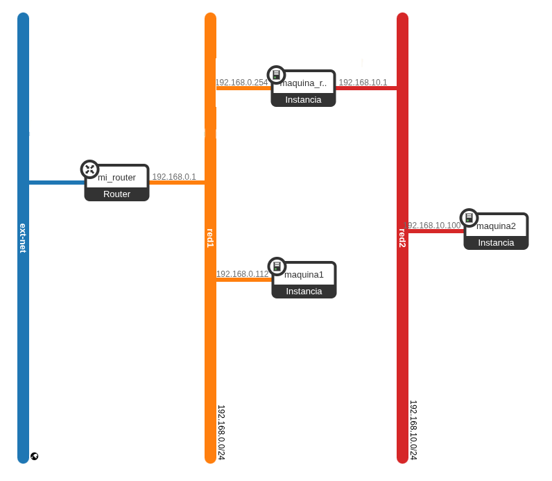

Como hemos visto en el apartado anterior, usar un router de OpenStack para conectar redes en nuestro escenario, nos da la posibilidad de que las máquinas tengan interconexión interna, pero no nos proporciona que las instancias internas tengan acceso a internet.

Una de las soluciones que vamos a poner ahora en funcionamiento, es **sustituir el router por una instancia linux que haga de router/nat**.

## Creación de la instancia router

Lo primero que vamos a hacer es quitar el segundo router que habíamos creado anteriormente, antes vamos a quitar las distintas rutas que habíamos creado:

        openstack subnet set --no-host-route subred1
        openstack router set --no-route mi_router
        openstack router set --no-route mi_router2        

Ahora ya podemos quitar el router:

        openstack route remove port mi_router2 port_router2
        openstack route remove subnet mi_router2 subred2
        openstack router delete mi_router2

**NOTA**: Esto lo hacemos porque estamos continuando el ejercicio anterior donde habíamos creados las rutas. si hacemos el ejercicio desde 0, no sería necesario.

Otra cosa **importante**: si conectamos la nueva instancia a **red1** y **red2**, tenemos un problema. Las dos redes tienen un servidor DHCP y tienen la puerta de enlace habilitada por lo tanto la instancia va a recibir **dos rutas por defecto** y por la tanto no va tener conectividad. Para solucionarlo vamos a eliminar **maquina2** y **red2** y creamos una nueva red interna si DHCP y donde deshabilitamos la puerta de enlace. Para ello:

        openstack server delete maquina2
        openstack port delete port_maquina2
        openstack network delete red2

        openstack network create red2
        openstack subnet create --network red2 --no-dhcp --gateway none --subnet-range 192.168.10.0/24 --dns-nameserver 172.22.0.1 subred2

Y volvemos a crear la **maquina2** con la misma IP, pero como no tenemos DHCP, y además esta red todavía no está conectada a ningún router, tenemos que habilitar el **config-drive**:

        openstack port create --network red2 --fixed-ip ip-address=192.168.10.100 port_maquina2

        openstack server create --flavor m1.mini \
        --image "Debian 13 Trixie" \
        --security-group default \
        --key-name jdmr \
        --port port_maquina2 \
        --config-drive True \
        maquina2

Ahora creamos la instancia que va a funcionar de router/nat, vemos que está conectado dos puertos de las dos redes que vamos a crear, pero solo va recibir una ruta por defecto, por que en la **red2** hemos deshabilitado la puerta de enlace:

        openstack port create --network red1 --fixed-ip ip-address=192.168.0.254 port_red1
        openstack port create --network red2 --fixed-ip ip-address=192.168.10.1 port_red2


        openstack server create --flavor m1.mini \
        --image "Debian 13 Trixie" \
        --security-group default \
        --key-name jdmr \
        --port port_red1 \
        --port port_red2 \
        maquina_router2

Podemos comprobar que a esa máquina le podemos asociar una IP flotante, podemos acceder, tiene dos interfaces y una sóla ruta por defecto:

        openstack server add floating ip maquina_router2 172.22.200.210

        ssh -A debian@172.22.200.210
        ...
        debian@maquina-router2:~$ ip a
        ...
        2: ens3: <BROADCAST,MULTICAST,UP,LOWER_UP> mtu 1442 qdisc fq_codel state UP group default qlen 1000
        ...
            inet 192.168.0.254/24 metric 100 brd 192.168.0.255 scope global dynamic ens3
        ...
        3: ens4: <BROADCAST,MULTICAST,UP,LOWER_UP> mtu 1442 qdisc fq_codel state UP group default qlen 1000
        ...
            inet 192.168.10.1/24 brd 192.168.10.255 scope global ens4
        ...

        debian@maquina-router2:~$ ip r
        default via 192.168.0.1 dev ens3 proto dhcp src 192.168.0.254 metric 100 
        ...

El escenario que hemos construido es:



## ¿Qué quedaría?

1. Configura la máquina **maquina-router2** para que haga de router/nat de forma persistente.
2. Como hemos deshabilitado la puerta de enlace en la **red2**, tendrás que entrar en la **maquina2** y manualmente configurar la puerta de enlace en netplan.
3. Con todos esos cambios **todavía no funcionará**. Para que funcione tenemos que deshabilitar los grupo de seguridad.


## Deshabilitar el grupo de seguridad de una instancia

* OpenStack nos proporciona un **cortafuegos por cada interfaz de red** que tiene una instancia. Las reglas de este cortafuegos están gestionadas en los **Grupos de Seguridad**.
* Tenemos la opción de **habilitar o deshabilitar** la seguridad de un determinado puerto, es decir **activar o desactivar el cortafuegos** para cada interfaz.
* El cortafuegos, tiene reglas asociadas a nuestra configuración de los Grupos de Seguridad (por ejemplo, abrir el puerto 80).
* Además tiene reglas adicionales para evitar **ataques de spoofing**. Estas reglas que aumentan la seguridad de los puertos provocan que algunos escenarios que montamos en OpenStack no funcionen de manera adecuada, por ejemplo, **si queremos que una instancia haga de router**.
* **Cuando una instancia intenta actuar como router, envía paquetes cuyo origen o destino no coincide con la IP asignada a su puerto.** OpenStack interpreta este comportamiento como un posible ataque (IP/MAC spoofing) y **bloquea el tráfico automáticamente**. Por este motivo, aunque el sistema operativo tenga habilitado el IP forwarding y reglas de NAT configuradas, **los paquetes no llegan a salir o no vuelven**, haciendo que el escenario de "máquina router" no funcione si no se ajusta la seguridad del puerto.
* Tenemos que quitar los grupos de seguridad de todas las instancias con las que estamos trabajando, las dos de **maquina-router2** y la interfaz de **maquina2**.

Para quitar el grupo de seguridad a **maquina2**, para quitar el cortafuego que le hemos asignado:

* Lo primero es quitar el grupo de seguridad a la instancia:

        openstack server remove security group maquina2 default

* Ahora la instancia tiene todos los puertos cerrado, por lo que a continuación hay que deshabilitar la seguridad del puerto:

        openstack port set --disable-port-security port_maquina2
    
* Nota: Si el puerto no tiene nombre tenemos que indicar el id del puerto.

Se pueden hacer también, las dos operaciones, ejecutando:

```
openstack port set --disable-port-security --no-security-group port_maquina2
```


## Ejercicio

1. Si has realizado el ejercicio anterior: **Clase 7: Red interna conectada con un router OpenStack**, realiza los cambios que se muestran en este documento para quitar el router de la práctica anterior y poner una instancia que haga de router/nat.
2. Si no has realizado la práctica anterior empieza **desde 0**:
        * Crea una red NAT con DHCP, la puedes llamar red1.
        * Crea una red interna sin DHCP y deshabilitando la puerta de enlace, la puedes llamar **red2**.
        * Crea una instancia **mauqina-router** conectada a esas dos redes, ten en cuenta que sería bueno que la interfaz conectada  a la **red1** sea la primera dirección (fíjate en el diagrama).
        * Crea una instancia en la **red2**, recuerda que debes configurarla usando el **config-drive**, ya que no tiene DHCP.
        * Como la red tiene deshabilitada la puerta de enlace, la **maquina2** no la tiene configurada. Entra en la máquina y configura manualmente la puesta de enlace en netplan.
        * Deshabilita los grupos de seguridad de todas las interfaces de las dos máquinas.
        * Configura el router/nat de forma persistente en **maquina-router**.
        * Comprueba que funciona en la **maquina2**.

<div class="notice--warning">{{ notice-text | markdownify }}</div>

