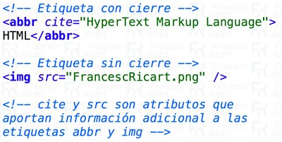
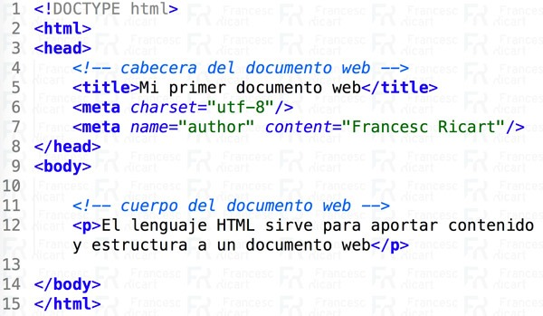

https://francescricart.com/tutorial-html/

# Introducción a HTML

El HTML es un lenguaje de marcado que constituye uno de los pilares de la web. Fue inventado por Tim Berners Lee en 1990 a partir de otro lenguaje denominado SGML y que servía para dotar de estructura documental a una información.

El lenguaje de marcado es básicamente un idioma que se caracteriza por etiquetar el contenido de una página web. El HTML nos ayuda a conferir a los documentos web de **contenido y estructura**.

Etiquetamos las distintas partes de un documento web para aportar información al usuario, a los motores de búsqueda y a los navegadores.

## Veamos primero el concepto de etiqueta web

Consideraciones previas sobre el HTML:

* El **HTML no es un lenguaje de programación**.
* El HTML es un lenguaje de marcado en el que describimos como serán los contenidos y la estructura de un documento web.
* La base del HTML es el **hipertexto**. Entendemos por hipertexto la capacidad de enlazar documentos web de forma no secuencial.
* Los archivos tienen la extensión `.html`.

## Concepto de etiqueta web

Una etiqueta es una información técnica que es capaz de ser detectada e interpretada por un navegador web. Las etiquetas pueden contener **atributos** que informan a los navegadores de los matices que se deben aplicar a un determinado marcado.

Las etiquetas generalmente tienen una instrucción de apertura y una instrucción de cierre. `<>` y `</>`.

Existen también etiquetas que no tienen instrucción de cierre. En este caso se recomienda indicar una contrabarra `/>`. 

HTML5 incorpora etiquetas semánticas que además de aportar información para los navegadores también aportan informaciones para los motores de búsqueda.

Consideraciones importantes:

* No se deben poner espacios en blanco entre el nombre de la etiqueta y la contrabarra. `
` sería incorrecto por el espacio en blanco entre p y /
* El cierre de la etiqueta nunca lleva ningún atributo. Sólo los pondremos con la etiqueta de apertura, ya sea una apertura con cierre y apertura o únicamente con apertura.

## Estructura HTML básica de un documento web

HTML como lenguaje que es tiene un vocabulario y una sintaxis básica que debemos conocer. En el caso de la imagen adjunta:

* `<!DOCTYPE html>` Informa a los navegadores que a continuación van a leer HTML5. Esta línea no es una etiqueta sino una instrucción. 
* `<html></html>` Informa a los navegadores que en su interior es dónde vamos a encontrar el HTML5. Esta etiqueta debe abrirse y cerrarse una única vez por documento web. Justo a continuación de la instrucción !DOCTYPE y al finalizar el documento web.
* `<head></head>` Es la cabecera del documento web. La cabecera del documento web contiene informaciones técnicas para los navegadores web y para los motores de búsqueda. Por ejemplo aquí dentro encontraréis la etiqueta `<title>` y los `<meta>`. Sólo debe aparecer un `<head>` en un documento web.
* `<title></title>` Informa a los motores de búsqueda cual es el contenido de la página web. Sólo se debe indicar una vez por documento web. Es fundamental para el SEO.
* `<body></body>` Es el cuerpo del documento web. Encierra las etiquetas que van a aportar estructura y contenido a nuestro documento web. También sólo se escribe una única vez por documento web.

