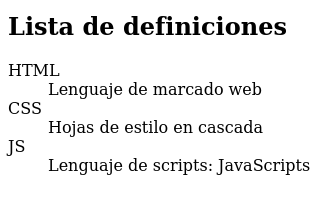

## Listas ordenadas y no ordenadas

Las **listas** nos permiten colocar texto en líneas separadas. Pueden ser listas ordenadas o no ordenadas. Para las primeras usamos las etiquetas:

`<ol></ol>`

mientras que para las segundas:

`<ul></ul>`

Los elementos colocados dentro de la lista, ordenadas o sin ordenar, se sitúan con la etiqueta:

 `<li>Elemento de la lista</li>`

Esta etiqueta debe estar siempre dentro de alguna de las anteriores. Todos las etiquetas usadas para describir listas son **etiquetas de bloques**.

Ejemplo de uso de listas ordenadas y no ordenadas

```html
<!DOCTYPE html>
<html lang="es" dir="ltr">
  <head>
    <meta charset="utf-8">
    <title>Listas</title>
  </head>
  <body>
    <h2>Lista ordenada. Pasos:</h2>
    <ol>
      <li>Conectarse al servidor</li>
      <li>Solicitar documento</li>
      <li>Esperar respuesta</li>
    </ol>
    <h2>Lista no ordenada. Comprar:</h2>
    <ul>
      <li>Leche</li>
      <li>Café</li>
      <li>Pan</li>
    </ul>
  </body>
</html>
```

Queda renderizado de la siguiente manera:


La etiqueta `<ol>` puede ir acompañada del atributo `type` con alguno de estos valores: `1 | A | a | I | i` para indicar el formato de la lista.
La etiqueta `<ul>` pueder ir acompañada de las etiquetas: `reversed` para decrementar el contador, y `start` para que la numeración empieza en el entero que indiquemos.

## Listas de definiciones

Usamos las etiquetas `<dl>, <dt>, <dd>`:

* `<dl>` se emplea para declarar la lista.
* `<dt>` se emplea para definir el término que definiremos.
* `<dd>` se emplea para expresar la definición de un término.

Ejemplo:

```html
<!DOCTYPE html>
<html lang="es" dir="ltr">
  <head>
    <meta charset="utf-8">
    <title>Listas</title>
  </head>
  <body>
    <h2>Lista de definiciones</h2>
    <dl>
        <dt>HTML</dt><dd>Lenguaje de marcado web</dd>
        <dt>CSS</dt><dd>Hojas de estilo en cascada</dd>
        <dt>JS</dt><dd>Lenguaje de scripts: JavaScripts</dd>
    </dl>
  </body>
</html>
```

Queda renderizado de la siguiente manera:

