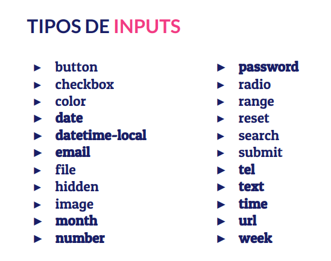
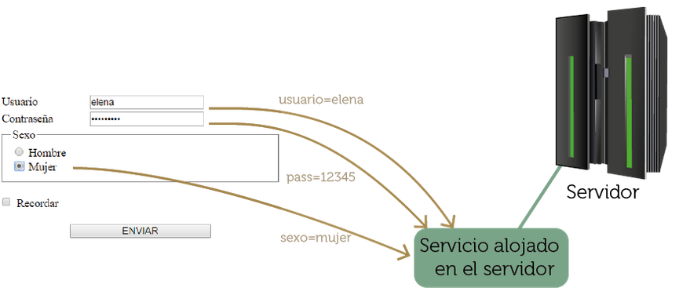

# Formularios

Los formularios son un elemento presente en muchas páginas web que nos permiten introducir información que se envía al servidor para su procesamiento.

El procesamiento de la información en el servidor necesita que nuestra página web este programada con un **lenguaje de programación web: PHP, Java, Python,** .... Ya que como hemos dicho **HTML5 no es un lenguaje de programación**.


## Estructura del formulario

Todos los elementos que nos vamos a encontrar en un formulario están dentro de la etiquete **<form>**. Esta etiqueta puede tener varios atributos de entre los que destacamos:

* **method** que indica cómo se va a pasar la información al destino. Puede ser por GET (se ve la información en la barra del navegador) y por POST ( no se ve y es la opción por defecto).
* **action** que indica el destino de nuestros datos. Normalmente será una URL que indica el programa que va a procesar dicha información. 

A continuación vamos a ver algunos de los elementos más frecuentes y a describir su estructura y funcionamiento.

### Labels e Input

Normalmente para la recogida de información los formularios usando etiquetas **<input>**. Pero, para poder saber qué campos estamos rellenando una buena práctica (se puede de otras maneras menos elegantes) es poner una etiqueta **<label>** (etiqueta) delante de cada input para dar nombre y asociar ambas.

Un ejemplo sería:

```html
<label for="nombre">Nombre:</label>
<input type="text" id="nombre" name="..." />
```

Aquí estamos asociando la etiqueta al campo usando los atributos **_for_** e **_id_**.

El campo que hemos usado para la recogida de información es un input. Existen muchos tipos que veremos con más detalle en el próximo apartado.

#### Tipos de Input en los formularios

La lista de tipos (type) de Inputs que podemos tener es muy larga. La podemos ver en la siguiente imagen:



El que más usado el **text** que nos proporciona la manera más secilla de introducir texto.

Veamos algunos otros:

* Radio Group

Es una agrupación de inputs que presenta opciones que queremos que sean excluyentes:

Un ejemplo sería:

```html
<label for="genero">Sexo</label>
<input type="radio" name="genero" value="masculino" />Hombre<br />
<input type="radio" name="genero" value="fememino" checked />Mujer<br />
```

Para que sean excluyentes deben de tener el mismo valor para el atributo **_name_** y el **_type="radio"_**

* CheckBoxes

Es una agrupación de opciones que presenta opciones de las cuáles podemos elegir una o varias.

Un ejemplo sería:

```html
    <label for="dispositivos">Dispositivos electrónicos</label><br />
    <input type="checkbox" name="dispositivos" value="pc" />PC<br />
    <input type="checkbox" name="dispositivos" value="table" />Tableta<br />
    <input type="checkbox" name="dispositivos" value="movil" />Móvil
```

Fijaros que para agruparlos deben de tener el mismo valor para **name** y el **_type="checkbox"_**


* Data Lista

Es una nueva forma en HTML5 de hacer una lista de valores posibles para un input.

Un ejemplo sería:

```html
    <input list="editor">

    <datalist id="editor">
        <option value="Atom">
        <option value="NotePad++">
        <option value="VsCode">
        <option value="Sublime">
        <option value="Brackets">
    </datalist>
```

Con el atributo **list** indicamos la lista de opciones que vamos a tener y en la etiqueta **<datalist>** metemos las **<option>** que queramos.

Es importante destacar que podríamos meter otras opciones en el Input pero al usar esta estructura se nos ayuda a rellenarlo y a elegir la opción correcta.

## Envío de información al servidor usando formularios

Cada componete de un formulario HTML posee un nombre al cual se le asigna un valor, el cual se corresponde con lo que el usuario introduce en el componente.

Cuando se envían los datos del formulario (normalmente a través de un botón), se envían todos los nombres y valores de los controles del formulario. En el caso típico, un servicio de Internet recoge esta información y hace algo con ella.



### Envío de datos usando el método GET

Una petición HTTP usando el método GET, nos permite solicitar la respuesta de una URL determinada. En este método los datos se pasan en la propia URL. Por ejemplo:

https://jorgesanchez.net/manuales/html/formularios-html.html
https://francescricart.com/creacion-de-formularios-html/