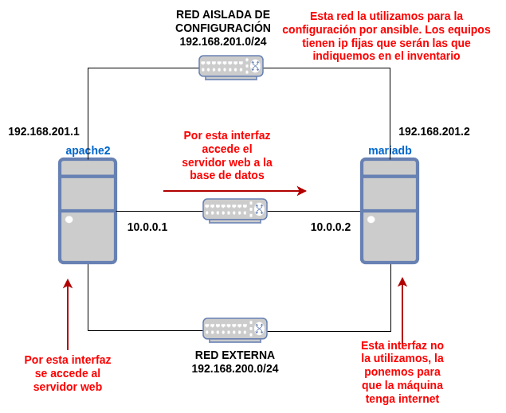

## Objetivos del proyecto

* Crear un escenario virtualizado con OpenTofu
* Configurarlo de forma automática con ansible

## Entorno de trabajo

Para realizar este proyecto vamos a partir del **escenario 3** del repositorio [opentofu-libvirt](https://github.com/josedom24/opentofu-libvirt/tree/main). El escenario que creamos es el siguiente:

* Un servidor web por el que accedemos por una **red NAT** desde el exterior. Que está conectado a una base de datos por una **red aislada**.
* Un servidor de base de datos que hemos conectado a la **red NAT** para que tenga internet y a la red aislada por donde se comunica con el servidor web.
* Las dos máquinas están conectadas a una **red aislada sin DHCP** que hemos llamado de **configuración**. Por esta red es por la que vamos a configurar el escenario por ansible. Al tener direcciones IP fijas podemos configurarlas en el inventario de ansible sin problemas.

## Configuración del escenario

A continuación tenemos un playbook ansible que configura el escenario:

* En el servidor web instala un servidor LAMP e implanta una aplicación PHP que tendrá datos en la base de datos.
* En la base de datos instala mariadb, crea la base de datos necesarias y la configura para el acceso remoto.

En este momento, y antes de continuar, estudia el escenario opentofu y el playbook ansible. Y cra el escenario y configúralo y comprueba que funciona de manera adecuada.

## Desarrollo del proyecto

El proyecto consiste en tomar como base dicho escenario y configuración y realizar un proyecto donde podéis introducir distintas variaciones:

* Instalar otra aplicación, por ejemplo la de Biblioteca.
* Instalar un CMS PHP completo, como WordPress, Drupal,...
* Utilizar otro sistemas operativos utilizando otras imágenes bases.
* Usar para ejecutar el PHP el servidor de aplicaciones php-fpm.
* Usar el servidor web nginx.
* Configurar php-fpm en otra máquina.
* Que el servidor web haga de router/nat y entonces no es necesario que la máquina de la base de datos este conectada a la red NAT.
* Crear varios virtualhost e instalar varias aplicaciones.
* Conectar el servidor web a br0 con lo que tendrá acceso desde toda nuestra red.
* Instalar un servidor NAS en otra máquina.
* Instalar la aplicación **phpmyadmin** para gestionar la base de datos de forma gráfica.
* Otros cambios que consideres interesantes.

¿Qué tienes que hacer?

1. Elige los cambios que vas a realizar al escenario base. Algunas variaciones son excluyentes pero puedes escoger las que creas conveniente.
2. Crea un repositorio github donde vas guardando los cambios. Se tiene que ver el historial de commits con **mensajes signficativos**.
3. Si no quieres escoger tú los cambios, dile al profesor que te sugiera un cambio.
4. De cada cambio, debes indicar en Redmine: el cambio realizado, los ficheros modificados y algunas pruebas de funcionamiento.