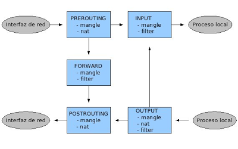
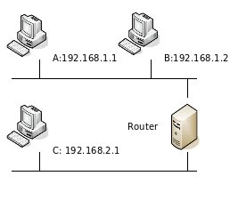
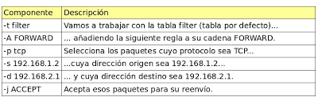
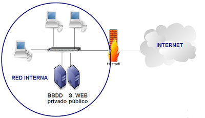
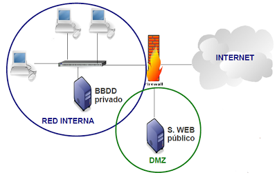
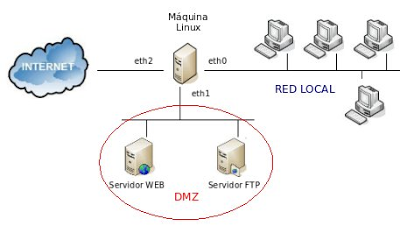

Un cortafuegos (firewall) es un dispositivo hardware o software que tiene como objetivo proteger una red de otras redes a las que está conectado. El cortafuegos se configura con una serie de reglas que determinan el tráfico que puede pasar de una red a otra y el tráfico que debe ser bloqueado.
Para comprender el funcionamiento de un cortafuegos, podemos pensar en cómo desempeñan su trabajo los guardias de seguridad de una discoteca. Los dueños del local establecen los criterios que debe cumplir un potencial cliente para poder pasar a la sala y, cada vez que alguien llega a la puerta, el portero lo evalúa:

* si cumple los criterios → pasa
* si no los cumple  → no pasa

En la siguiente figura se representa el esquema de una red de ordenadores que utiliza un cortafuegos para proteger la red local de la red externa:

Se pueden construir cortafuegos más sofisticados, como veremos a lo largo del artículo, que incluyen equipos separados del resto de la red local (**DMZ: Zona Desmilitarizada**) para aumentar aún más la seguridad. De hecho, en las grandes corporaciones, es posible encontrar instalaciones con más de un cortafuegos, que separan los equipos de diferentes áreas de la empresa.
 
## Linux como cortafuegos

El núcleo de las máquinas GNU/Linux incorpora el framework Netfilter, que permite interceptar y manipular paquetes de red. Además, en el espacio de usuario, el administrador puede usar iptables para establecer las reglas del firewall.

### iptables

`iptables` se usa para crear, mantener y revisar las tablas de filtrado de paquetes en el kernel de Linux, y se estructura de la siguiente manera:
 
* Existen diferentes tablas (tables) dentro de las cuales puede haber varias cadenas (chains). 
* Cada cadena consiste en una lista de reglas con las que se comparan los paquetes que pasan por el cortafuegos. Las reglas especifican qué se hace con los paquetes que se ajustan a ellas (target).

Para cada paquete que recibe el cortafuegos, se examina la primera regla de la cadena correspondiente. Si el paquete no se ajusta a esa regla, se continúa examinando la siguiente hasta que se ajusta  con alguna. En ese momento se ejecuta el target:

* DROP: el paquete se descarta, no puede pasar 
* ACCEPT: el paquete continúa su camino normal

Si se llega al final de una cadena predefinida se ejecuta un target por defecto, llamado `chain policy`. El `chain policy` establece, por tanto, la política por defecto de nuestro cortafuegos.

### Tablas

Como decíamos, en iptables existen varias tablas, que tienen diferentes objetivos:

* La tabla `filter` es la tabla por defecto, y se utiliza para especificar filtros de paquetes. Contiene 3 chains predefinidas:

    * INPUT: Se consulta para los paquetes que van dirigidos al propio cortafuegos
    * FORWARD: La atraviesan los paquetes enrutados a través de esta máquina, es decir, aquellos paquetes en los que el origen y el destino son equipos de redes diferentes.
    * OUTPUT: Para paquetes generados localmente

* La tabla `nat` se consulta cada vez que se ve un paquete que inicia una nueva conexión, con el objetivo de alterar algún parámetro de esa conexión. Tiene 3 chains predefinidas: 

    * PREROUTING: se consulta con los paquetes que entran en la máquina cortafuegos, tan pronto como llegan, antes de decidir qué hacer con ellos. 
    * OUTPUT: se utiliza para alterar paquetes generados localmente, antes de enrutarlos. 
    * POSTROUTING: para alterar los paquetes que están a punto de salir de la máquina.

* La tabla `mangle` es una tabla especial, destinada a alterar determinados parámetros de los paquetes (TOS, TTL ...), que se utiliza para realizar configuraciones complejas del cortafuegos. Cuenta con 5 chains predefinidas: INPUT, OUTPUT, PREROUNTING, POSTROUTING Y FORWARD.

### Flujo de los paquetes a través de iptables

Veamos todos los posibles caminos que un paquete puede seguir al atravesar nuestro cortafuegos.
 

Veamos el camino que seguiría, por ejemplo, un paquete que se origina en nuestra red local y va destinado a una máquina de Internet:

* El paquete entra en el cortafuegos por una interfaz de red, por tanto, primero se comprobarían las reglas de la cadena PREROUTING.
* A continuación se comprobarían las reglas de la cadena FORWARD, ya que el paquete no va destinado a un proceso del cortafuegos, si no que va a atravesarlo, saliendo por la interfaz que lo conecta con la red externa.
* Por último, si el paquete no ha sido filtrado y sigue adelante, antes de salir del cortafuegos por la otra interfaz de red, se comprueban las reglas de la cadena POSTROUTING

### Comandos de configuración
 
Vamos a ir explicando, a continuación, los comandos básicos de configuración de iptables. Veremos algún ejemplo sencillo, y terminaremos con un ejemplo completo de configuración de un firewall con DMZ.
 
#### Listado de reglas: 

    iptables [-t tabla] [opciones] -L [chain]

Muestra un listado de todas las reglas de una cadena, o de todas ellas. Las opciones disponibles son:

* `-v`: información detallada
* `-n`: salida numérica
* `-x`: valor exacto de cada número
 
#### Borrado de contadores:

    iptables [-t tabla] -Z [chain]

Borra los contadores de una determinada chain, o de todas ellas. Es habitual colocar este comando al principio de todos los script de configuración, para borrar las reglas que existieran de antemano. Se puede combinar con la opción -L para mostrar la información justo antes de borrarla.
 
#### Borrado de reglas:

    iptables [-t tabla] -F [chain]

Borra las reglas de una determinada chain o de todas ellas.
 
#### Creado y borrado de reglas:

    iptables [-t table] -A chain rule-spec
    iptables [-t table] -I chain [rulenum] rule-spec
    iptables [-t table] -R chain rulenum rule-spec
    iptables [-t table] -D chain rule-spec
    iptables [-t table] -D chain rulenum

Las opciones son las siguientes:

* `-A`: añade una regla al final de la lista
* `-I`: inserta una regla al comienzo de la lista o en el punto especificado
* `-R`: reemplaza una regla (especificada por su número de regla) por otra
* `-D`: borra una regla determinada
 
Para especificar una regla podemos usar los siguientes parámetros:

* `-p [!] protocolo`: el protocolo del paquete a comprobar. Puede ser 'tcp', 'udp', 'icmp' o 'all'
* `-[sd] [!] dirección[/máscara]`: dirección ip origen (s) o destino (d) del paquete
* `-[io] [!] iface`: nombre de la interfaz de entrada (i) o de salida (o) del paquete
* `-j target`: especifica el target de dicha regla. Puede ser una acción predefinida (ACCEPT, DROP), una extensión o el nombre de una chain
 
#### Establecimiento de un política por defecto:

    iptables [-t table] -P chain target

Establece el taget que se ejecutará para los paquetes que no cumplan con ninguna regla de la chain especificada.

## Un ejemplo sencillo 

Con estos comandos básicos de configuración ya podemos resolver muchos de los problemas con los que se encuentra una empresa al exponer sus sistemas de información a Internet.
Vamos a ver un ejemplo sencillo para entender cómo se deben escribir las reglas en iptables. Observemos la figura 3, que representa una instalación sencilla, con una máquina que actúa como router y cortafuegos conectando dos redes distintas.

Supongamos que queremos que sólo la máquina B pueda hablar con C, y además sólo pueda usar el protocolo TCP. Los paquetes que no cumplan estas condiciones serán descartados.
Lo primero que tenemos que decidir es ¿en qué tabla y en qué cadena vamos a colocar las reglas? En este caso, queremos realizar filtrado de paquetes, por lo que está claro que trabajaremos con la tabla filter... pero ¿en la cadena INPUT, OUTPUT o FORWARD? Como los paquetes que queremos filtrar son los que van a atravesar el Firewall de una red a otra, trabajaremos con la cadena FORWARD.
Los comandos que deberíamos usar para conseguir estos objetivos son los siguientes:

    iptables -F FORWARD
    iptables -P FORWARD DROP
    iptables -t filter -A FORWARD -p tcp -s 192.168.1.2 -d 192.168.2.1 -j ACCEPT
    iptables -t filter -A FORWARD -p tcp -s 192.168.2.1 -d 192.168.1.2 -j ACCEPT

* La línea 1 borra las reglas que pudiera haber en la cadena FORWARD de la tabla filter (que es la tabla por defecto).
* La línea 2 establece la política por defecto a DROP (denegar), por lo tanto, los paquetes que no cumplan con las reglas que especifiquemos serán rechazados.
* Las líneas 3 y 4 permiten el tráfico entre las máquinas B y C según las reglas especificadas en el enunciado. 

 Los aministradores no suelen sentarse delante de la máquina que actúa como cortafuegos y ejecutan los comandos uno a uno. Es más habitual escribir todos los comandos en un script de shell y ejecutar solamente el script. No sólo se hace por comodidad, sino porque esta opción permite incluir comentarios y reutilizar el código:

    #!/bin/bash
    ##Script de iptables – Un ejemplo sencillo

    ##Borramos las reglas de la chain FORWARD de la tabla filter
    iptables -F FORWARD

    ##Establecemos la política por defecto -> DROP
    iptables -P FORWARD DROP

    ##Aceptamos los paquetes TCP entre B y C
    iptables -t filter -A FORWARD -p tcp -s 192.168.1.2 -d 192.168.2.1 -j ACCEPT
    iptables -t filter -A FORWARD -p tcp -s 192.168.2.1 -d 192.168.1.2 -j ACCEPT

## Extensiones de target
 
Existen otros target diferentes a DROP y ACCEPT que permiten que nuestro cortafuegos realice otras funciones a parte del filtrado de paquetes:
 
* MASQUERADE: sólo es válida en la chain `POSTROUTING`. Indica que la dirección origen del paquete (y de todos los de esa conexión) será cambiada por la IP local de esta máquina. Muy útil para IP dinámica (es lo que se conoce como NAT)

Ejemplo:

    iptables -t nat -A POSTROUTING -o eth1 -j MASQUERADE
 
* SNAT: sólo es válida en la chain POSTROUTING. Indica que la dirección y puerto origen del paquete (y de todos los de esa conexión) sea modificada según se especifica con la opción `--to-source`. El target será `SNAT` (en lugar de `MASQUERADE`) cuando tengamos una IP fija.

Ejemplo:

    iptables -t nat -A POSTROUTING -o eth1 -j SNAT --to-source 189.29.35.15
 
* DNAT: sólo es válida en las chains `PREROUTING` y `OUTPUT`. Cambia la dirección IP destino (y de todos los futuros de esta misma conexión) por el especificado con la opción `--to-destination`. Es lo que se conoce como 'abrir el puerto' en el router.
Por ejemplo, si la máquina 192.168.1.2 de nuestra red local aloja un servidor web que queremos que sea accesible desde la red externa:

    iptables -t nat -A PREROUTING -i eth0 -p tcp --dport 80 -j DNAT --to-destination 192.168.1.2:80

## DMZ, zona desmilitarizada

Observa la figura siguiente, que representa una red en la que tenemos un servidor web público, al que vamos a permitir el acceso desde Internet, y un servidor de BBDD privado, con toda la información de nuestra empresa.

¿Qué ocurriría si un atacante consigue comprometer la seguridad de nuestro servidor web? A partir de ese momento, el acceso a los recursos de la red local sería inmediato, ya que ambos servidores se encuentran en la misma red.

En estos casos, el uso de una DMZ permite que se puedan dar servicios a la red externa a la vez que se protege la red interna en el caso de que un intruso comprometa la seguridad de los equipos situados en la zona desmilitarizada:

### Un ejemplo completo

Observemos la imagen, que representa la configuración de la red de nuestra empresa:

En el ejemplo supondremos que nuestra máquina GNU/Linux está conectada a un ROUTER que nos proporciona el acceso a Internet por la interfaz eth2. Este router está configurado como monopuesto (no hace NAT y deja pasar todo el tráfico a nuestra máquina Linux).

Las direcciones de la máquina son las siguientes:

* eth0: 192.168.1.1/24
* eth1: 192.168.2.1/24
* eth2: dirección IP obtenida por DHCP (dinámica)

En la DMZ tenemos un servidor WEB y un servidor SSH que queremos sean accesibles desde Internet y la red local. Las direcciones son:

* Servidor WEB: 192.168.2.2/24
* Servidor FTP: 192.168.2.3/24

Las máquinas de la red local podrán navegar por Internet accediendo a servidores WEB, servidores WEB Seguros, servidores FTP y servidores DNS. El resto de conexiones serán filtradas.

Todas las máquinas de la red local tienen direcciones del rango 192.168.1.0/24.

Supondremos que en el firewall hay instalado un servidor ssh para que el administrador pueda conectarse desde la red local.

Se presenta a continuación un script, con una parte configurable por el usuario, para que pueda ser fácilmente adaptado a otras instalaciones y requisitos:

    #!/bin/bash

    ####################################################################   
    #plo de configuración de un firewall con DMZ y red local           #
    ####################################################################

    ### SECCIÓN CONFIGURABLE POR EL USUARIO ###

    # REDLOCAL    Dirección IP de la red local interna
    # BCASTLOCAL    Dirección de Broadcast de la red local
    # IFAZLOCAL    Nombre del interfaz de red local
    # CUALQUIERA    Dirección de red 0.0.0.0
    # IFAZEXT        Nombre del interfaz de red externo
    # WEB        Dirección IP del servidor WEB
    # FTP            Dirección IP del servidor FTP
    # REDDMZ        Dirección IP de la red DMZ
    # IFAZDMZ        Nombre del interfaz de red de la DMZ
    # TCPLOCAL    Lista de puertos TCP que permitimos usar en la red local
    # UDPLOCAL    Lista de puertos UDP que permitimos usar en la red local

    REDLOCAL = "192.168.1.0/24"
    BCASTLOCAL = "192.168.1.255"
    IFAZLOCAL = "eth0"

    CUALQUIERA = "0/0"
    IFAZEXT = "eth2"

    WEB = "192.168.2.2"
    FTP = "192.168.2.3"
    REDDMZ = "192.168.2.0/24"
    IFAZDMZ = "eth1"

    TCPLOCAL = "www,ftp,ftp-data,https"

    UDPLOCAL = "domain"

                    ###IMPLEMENTACIÓN###

    # Borramos todas las reglas que pudiera haber anteriormente, y los contadores

    iptables -F
    iptables -t nat -F
    iptables -X         #borra las cadenas creadas por el usuario
    iptables -Z
    # Cambiamos la política por defecto en todas las cadenas de la tabla filter
    # Chain Policy -> DROP

    iptables -P FORWARD DROP
    iptables -P INPUT DROP
    iptables -P OUTPUT DROP

    # Permitimos que se acceda al cortafuegos por ssh

    iptables -A INPUT -s $REDLOCAL -p tcp --dport 22 -j ACCEPT
    iptables -A OUTPUT -d $REDLOCAL -p tcp --sport 22 -j ACCEPT

    ##CONEXIONES TCP

    # Permitimos las conexiones establecidas, desde la red externa y desde la DMZ hacia la red local en los puertos permitidos

    iptables -A FORWARD -d $REDLOCAL -p tcp  -m state --state ESTABLISHED -m multiport --sports $TCPLOCAL -j ACCEPT

    # Permitimos el tráfico desde la red local hacia la red externa y hacia la DMZ en los puertos permitidos

    iptables -A FORWARD -s $REDLOCAL -p tcp -m multiport --dports $TCPLOCAL -j ACCEPT

    # Permitimos el tráfico desde la red local y desde la red externa al servidor WEB  por el puerto 80

    iptables -A FORWARD -d $WEB -p tcp --dport 80 -j ACCEPT

    # Permitimos las conexiones establecidas desde el servidor WEB a la red local y a la red externa

    iptables -A FORWARD -s $WEB -p tcp --sport 80 -m state --state ESTABLISHED -j ACCEPT

    # Permitimos el tráfico desde la red local y desde la red externa al servidor FTP por el puerto 20 y 21

    iptables -A FORWARD -d $FTP -p tcp --dport 20:21 -j ACCEPT

    # Permitimos las conexiones establecidas desde el servidor FTP a la red local y a la red externa

    iptables -A FORWARD -s $FTP -p tcp --sport 20:21 -m state --state ESTABLISHED -j ACCEPT

    # Permitimos las conexiones relacionadas desde el servidor FTP a la red local y a la red externa

    iptables -A FORWARD -s $WEB -p tcp --sport 20:21 -m state --state RELATED -j ACCEPT

    ##CONEXIONES UDP

    # Permitimos las conexiones establecidas desde la red externa hacia la red local en los puertos permitidos

    iptables -A FORWARD -d $REDLOCAL -i $IFAZEXT -p udp  -m state --state     ESTABLISHED -m multiport --sports $UDPLOCAL -j ACCEPT

    # Permitimos el tráfico desde la red local hacia la red externa  en los puertos permitidos

    iptables -A FORWARD -s $REDLOCAL -o $IFAZEXT -p udp -m multiport --dports     $UDPLOCAL -j ACCEPT

    ## Hacemos NAT para las máquinas de la red local y para las máquinas de la  DMZ

    iptables -t nat -A POSTROUTING -o eth2 -j MASQUERADE

    # Si la dirección IP Pública fuera estática haríamos SNAT

    ## Hacemos DNAT para que las peticiones que recibimos de Internet lleguen a los servidores

    iptables -t nat -A PREROUTING -i eth2 -p tcp --dport 80 -j DNAT --to-destination $WEB:80
    iptables -t nat -A PREROUTING -i eth2 -p tcp –dport 20 -j DNAT --to-destination $FTP:20