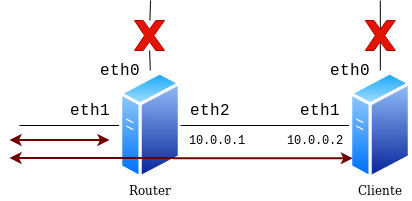

Queremos automatizar la creación de la siguiente infraestructura usando Vagrant, el esquema que queremos desarrollar, que vemos en la imagen, tiene las siguientes características:

* Es escenario tiene dos máquinas: 
  * `router`, que está conectada a una red pública y a una red privada. La interfaz de red en la red privada se configura con la IP `10.0.0.1`.
  * `cliente`: Esta máquina está conectada a la misma red privada que la máquina anterior, en este caso su direccionamiento es `10.0.0.2`.
* La máquina `router` debe acceder a internet por `eth1`. `eth0` sólo se utiliza para acceder a la máquina con `vagrant ssh`.
* La máquina `cliente` debe tener a cceso a internet. Para ello debe salir por `eth1` y la máquina `router` debe estar configurada para enrutar las peticiones de `cliente`. del mismo modo, `eth0` sólo se utiliza para acceder con `vagrant ssh`. Debes pensar que configuración debe tener la máquina `cilente`: puerta de enlace, configuración dns,...


## Ejercicios

1. Realiza un fichero `Vagrantfile` que construya el escenario. Intenta que todo lo que se pueda hacer en el fichero `Vagrantfile` se haga. Si no es posible lo tendrás que configurar manualmente.
2. Comprueba que `cliente` tiene acceso a internet haciendo ping a un nombre de una página web. Asegurate que no está saliendo por `eth0`.
3. Configura el sistema para que podamos acceder acceder a las máquinas por ssh. Te doy algunas ideas:

  * Puedes usar las claves privadas generadas para cada una de las máquinas, o puedes generar nuevas claves que introduces en las máquinas.
  * A lo mejor te viene bien la opción `-A ` de `ssh`.
  * Estudia el fichero `~/.ssh/config`. Configurando de forma adecuada el fichero de configuración de ssh en tu equipo hasta puedes hacer que se conecte directamente con `cliente`.
  * Las conexiones ssh nuncan las tienes que realizar por `eth0`.


{{ notice-text | markdownify }}

