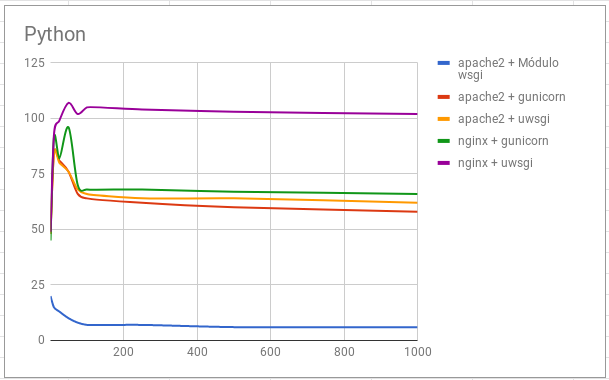

    
## Ejecución de scripts PHP

Vamos a comparar el rendimiento de distintas configuraciones de servidores web sirviendo páginas dinámicas programadas con PHP, en concreto vamos a servir un CMS Wordpress.

Las configuraciones que vamos a realizar son las siguientes:
	
* Módulo php5-apache2
* PHP-FPM (socket unix) + apache2
* PHP-FPM (socket TCP) + apache2
* PHP-FPM (socket unix) + nginx 
* PHP-FPM (socket TCP) + nginx 

### Rendimiento

Para cada una de las configuraciones hemos hecho prueba de rendimiento con el comando `ab`, por ejemplo durante 10 segundos , hmos hecho peticiones con 200 concurrentes:

    ab -t 10 -c 200 -k http://172.22.x.x/wordpressindex.php

Después de hacer varias pruebas de rendimiento con un número variable de peticiones concurrentes (1, 10, 25, 50, 75, 100, 250, 500, 1000). Los resultados obtenidos son los siguientes:

Podemos determinar que la opción que nos ofrece más rendimiento es **nginx + fpm_php (socket unix)**. Cuyo resultado es aproximadamente unas 600 peticiones/segundo (parámetro `Requests per second` de `ab`).

A partir de esa configuración vamos a intentar aumentar el rendimiento de nuestro servidor.

## Aumento de rendimiento en la ejecución de scripts PHP



* **Tarea 1**: Vamos a configurar una máquina con la configuración ganadora: **nginx + fpm_php (socket unix)**. Para ello ejecuta la receta ansible que encontraras en este [repositorio](https://github.com/josedom24/ansible_nginx_fpm_php).
* **Tarea 2**: Configura un **proxy inverso - caché Varnish** escuchando en el puerto 80 y que se comunica con el servidor web por el puerto 8080. Entrega y muestra una comprobación de que varnish está funcionando con la nueva configuración. Realiza pruebas de rendimiento (quedate con el resultado del parámetro `Requests per second` y comprueba si hemos aumentado el rendimiento. Si hacemos varias peticiones a la misma URL, ¿cuantas peticiones llegan al servidor web? (comprueba el fichero `access.log` para averiguarlo).

{{ notice-text | markdownify }}

## Ejecución de scripts Python

Vamos a comparar el rendimiento de distintas configuraciones de servidores web sirviendo páginas dinámicas programadas con Python, en concreto vamos a servir un CMS Mezzanine (Instala algunas páginas de demostración durante la instalación: `Would you like to install some initial demo pages?`).

Las configuraciones que vamos a realizar son las siguientes:
	
* apache2 + Módulo wsgi
* apache2 + gunicorn
* apache2 + uwsgi
* nginx + gunicorn
* nginx + uwsgi

### Rendimiento

Podemos observar que la opción que más rendimiento ofrece es nginx + uwsgi.