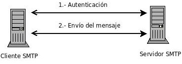

Esta situación podemos aprovecharla para el envío de correos entre usuarios de la máquina, disponiendo de correo interno. 

## Envío de correos

Para el envío de correo vamos a usar la utilidad `mail` (se encuentra en el paquete `bsd-mailx`). Y para enviar un correo desde el usuario debian al usuario root, simplemente ejecutamos:

debian@maquina:~$ mail root@DOMINIO
Subject: Hola
Esto es una prueba
Cc: 

**Recuerda que para terminar de escribir el cuerpo del mensaje hay que ponerse en una nueva línea e introducir CTRL+D.**

Para leer el usuario root simplemente ejecuta la instrucción `mail`:

root@maquina:~#  mail
Mail version 8.1.2 01/15/2001.  Type ? for help.
"/var/mail/root": 1 message 1 unread
>U  1 debian@DOMINIO  Sat Jan 16 18:22   79/3597  Re: hola
& 1

Introducimos el númerode correo para leerlo.

Como vemos el buzón del usuario está en `/var/mail/root`. Los correos leídos se guardan en `~/mbox`.

## Hablando directamente con el servidor en SMTP

Vamos a realizar el envío utilizando una conexión ``telnet``, muy interesante tanto para entender los pasos que sigue el protocolo SMTP:

	root@vostro:/home/jose# telnet localhost 25
	Trying 127.0.0.1...
	Connected to localhost.
	Escape character is '^]'.
	220 mail2.josedomingo.org ESMTP Postfix (Debian/GNU)
	HELO mail2.josedomingo.org
	250 mail2.josedomingo.org
	mail from: jose@josedomingo.org
	250 2.1.0 Ok
	rcpt to: usuario@josedomingo.org
	250 2.1.5 Ok
	data
	354 End data with <CR><LF>.<CR><LF>
	from: jose@josedomingo.org
	to: usuario@josedomingo.org
	subject: Prueba envio local	

	hola que tal	

	.
	250 2.0.0 Ok: queued as DE3232C16A
	quit
	221 2.0.0 Bye
	Connection closed by foreign host.

Pasemos a describir los pasos:

## Fases en el envío de un mensaje de correo

* **Fase de autenticación** (puede haber otra si la sesión es cifrada). El cliente lanza los comandos siguientes para indicar qué usuario envía el correo, y a quién va dirigido. En nuestro ejemplo el cliente no llega a autenticarse al no estar configurado el servidor de correo para ello, tan sólo se intercambian estos mensajes.
    * EHLO o HELO “cadena presentándose el cliente ante el servidor”
    * MAIL FROM: “dirección de correo del remitente”
    * RCPT TO: “dirección de correo del destinatario”
* **Fase de envío del mensaje**. El cliente lanza la orden DATA y el servidor responde indicando “354 End data with <CR><LF>.<CR><LF>”, lo que quiere decir que cuando el cliente finalice el mensaje y desee enviarlo debe escribir un punto y dar un retorno de carro, es decir, una vez a la tecla intro. El cliente lanza las cadenas
    * From: “dirección del remitente” + SALTO DE LÍNEA (ie intro)
    * To: “dirección del destinatario” + SALTO DE LÍNEA (ie intro)
    * Cc: “dirección del destinatario” para tener una copia + SALTO DE LÍNEA (ie intro)
    * Bcc: “dirección del destinatario” para tener una copia ciega
    * Date: “fecha” + SALTO DE LÍNEA (ie intro)
    * Subject: “asunto” + SALTO DE LÍNEA (ie intro)
    * MIME-Versión: “valor de la versión de MIME usada” + SALTO DE LÍNEA (ie intro)
    * Otras cabeceras + SALTO DE LÍNEA (ie intro)
    * DOS SALTOS DE LÍNEAS
    * Escribe el mensaje en varias líneas
    * DOS SALTOS DE LÍNEAS, y en el segundo escribe “.” para finalizar el mensaje, y el cliente lo envía al servidor

Podemos comprobar el log ``/var/log/mail.log`` para comprobar que se ha mandado el mensaje:

	Feb 6 18:10:05 vostro postfix/smtpd[3660]: DE3232C16A: client=localhost[127.0.0.1]
	Feb 6 18:11:07 vostro postfix/cleanup[3907]: DE3232C16A: message-id=<20120206171005.DE3232C16A@mail2.josedomingo.org>
	Feb 6 18:11:07 vostro postfix/qmgr[3531]: DE3232C16A: from=<jose@josedomingo.org>, size=400, nrcpt=1 (queue active)
	Feb 6 18:11:08 vostro postfix/local[3908]: DE3232C16A: to=<usuario@josedomingo.org>, relay=local, delay=75, delays=74/0/0/1, dsn=2.0.0, status=sent (delivered to command: procmail -a "$EXTENSION")
	Feb 6 18:11:08 vostro postfix/qmgr[3531]: DE3232C16A: removed
	Feb 6 18:11:09 vostro postfix/smtpd[3660]: disconnect from localhost[127.0.0.1]

