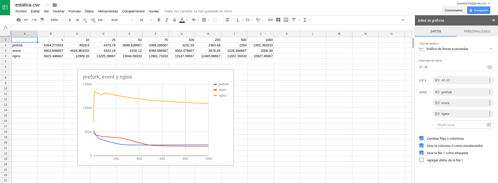

# Estudio de rendimiento de servidores web

Vamos a utilizar la herramienta `ab` para realizar pruebas sobre servidores web con distintas configuraciones y hacer un estudio del rendimiento de cada configuración. Para estudiar el rendimiento nos vamos a fijar en el número de peticiones respondidas por segundo por el servidor.

Hemos creado un programa [benchmark.py](https://github.com/josedom24/serviciosgs_doc/blob/master/rendimiento/benchmark.py) que realiza las siguienes operaciones:

* Durante un tiempo determinado hace pruebas con la utilidad `ab`. 
* Cada prueba va aumentado el nivel de concurrencia de conexiones que se hacen al servidor web.
* Cada prueba con un nivel de concurrencia determinado se hace sobre varios recursos (urls) del servidor estudiado.
* Cuando se cambia el nivel de concurrencia se reinician los servicios que se están usando.
* Finalmente por cada nivel de concurrencia te devuelve el valor medio del número respuestas por segundo que se ha conseguido en el acceso a los distintos recursos.

## Configuración del script benchmark.py

Para cada configuración que vamos a estudiar hay que configurar el script `benchmark.py` con los valores adecuados:

* `CONN`: Lista con el nivel de concurrencia que vamos a realizar en cada prueba.
* `TITULO`: Ponemos el nombre de la configuración estudiada.
* `DURACION`: Tiempo que va a durar cada test con `ab`.
* `IP`: Dirección IP del servidor. Nosotros vamos a a
hacer las pruebas desde el mismo servidor, por lo que la podemos dejar en `localhost`.
* `URLS`: Lista con las direcciones relativas que vamos a probar.
* `SERVERS`: Lista con los servicios que se van a reiniciar antes de cada prueba.

## Ejecución del script benchmark.py

Recuerda que antes de ejecutar el script debes tener instala la aplicación `ab` que se encuentra en el paquete `apache2-utils`.

Para ejecutar el programa:

	$ python benchmark.py

	Reiniciando apache2...
	Conexiones concurrentes 1
	URL: http://localhost/index.html
	11456.66 #/seg
	URL: http://localhost/images/bg.jpg
	3419.32 #/seg
	URL: http://localhost/web.zip
	1186.84 #/seg
	Reiniciando apache2...
	Conexiones concurrentes 10
	URL: http://localhost/index.html
	...
	prefork	"5354,27333333"	"4929,8"	"4375,78"	"3698,62666667"	"3369,16666667"	"3232,33"	"2363,48"	"2264,0"	"2302,38333333"

Realmente lo que nos interesa es la última linea donde encontramos el título, y las medias de las respuestas por segundos para cada uno de los niveles de concurrencia. Está última linea la copiamos y vamos creando un fichero csv con los datos de las distintas configuraciones estudiadas. En la primera línea ponemos los niveles de concurrencia que hemos estudiado (separados por tabuladores). Por ejemplo:

		1	10	25	50	75	100	250	500	1000
	prefork	"5354,27333333"	"4929,8"	"4375,78"	"3698,62666667"	"3369,16666667"	"3232,33"	"2363,48"	"2264,0"	"2302,38333333"
	event	"4802,68666667"	"4628,96333333"	"4332,16"	"4230,12"	"4069,58666667"	"4002,07666667"	"3678,65"	"2226,94666667"	"2006,94"
	nginx	"6923,48666667"	"12909,93"	"13225,2866667"	"13044,6933333"	"12801,7333333"	"13147,0966667"	"12465,8666667"	"11657,5933333"	"10927,4666667"

## Realización de la gráfica

El fichero csv que hemos generado lo podemos subir a google drive, y desde la aplicación de hoja de cálculo podemos generar una gráfica de este tipo:

