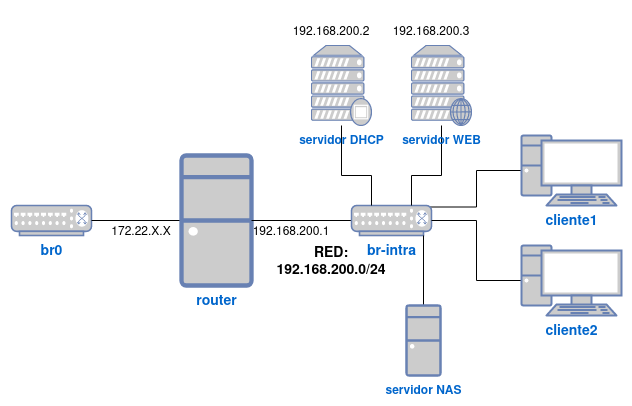

## Descripción

Vamos a crear una infraestructura con varias máquinas virtuales y contenedores donde vamos a instalar un servidor DHCP para configurar de forma dinámica la configuración de red.

## 1. Creación de la plantilla para las máquinas clientes

Vamos a crear una plantilla que utilizaremos para la creación de las máquinas que utilizaremos como clientes. Para ello:

1. Crea con `virt-install` una máquina virtual de Debian 12 con formato qcow2 y un tamaño de 3GiB. 
	* La máquina debe tener un usuario `debian` con contraseña `debian` que puede utilizar `sudo` sin contraseña.
	* Instala el servidor ssh en la máquina.
	* En el usuario `debian` copia tu clave pública y la mia para que podamos acceder sin introducir la contraseña por ssh.
2. Convierte la máquina virtual en una plantilla llamada **plantilla-cliente**. ¿Cuánto ocupa el volumen de la plantilla en disco?
3. Utiliza la herramienta `virt-sparsify` para reducir el tamaño ocupado en disco del volumen. ¿Cuánto ocupa ahora el volumen de la plantilla en disco?

## 2. Creación del escenario

Todas las operaciones las tiene que hacer desde la línea de comandos:

1. Crea una red muy aislada, que se llame **red_intra** que creará el puente `br-intra`.
2. Crea con `virt-install` la máquina **router** con Debian 12: 
	* Está conectada a la red pública (al bridge `br0`) y la **red_intra**.
	* Esta máquina utiliza un disco en formato **raw** de 10 Gb.
	* El hostname de esta máquina debe ser `router`.
	* Se debe poder acceder a ella por ssh con el usuario root sin que te pida contraseña (configura tu clave pública y la mia).
	* Debes configurar la segunda interfaz de red con direccionamiento estático para que tenga la dirección `192.168.200.1`.
3. Crea dos contenedores LXC conectados a la red **red_intra**.
	* **servidorDHCP**: configura su red de forma estática. Su dirección IP debe ser la `192.168.200.2`.
	* **servidorWeb**: configura su red de forma estática. Su dirección IP debe ser la `192.168.200.3`.
4. Configura la máquina **router** para que haga SNAT y permita que los contenedores tengan acceso al exterior. Instala en los contenedores el servidor ssh y configúralo para que podamos entrar con clave privada (configura tu clave pública y la mia) por ssh con el usuario `root`.

## 3. Instalación del servidor DHCP 

1. Instala un servidor DHCP en el contenedor **servidorDHCP** con las siguientes características:

* Rango de direcciones: `192.168.200.10` - `192.168.200.200`.
* Máscara de red: `255.255.255.0`
* Duración de la concesión: 30 minutos
* Puerta de enlace: `192.168.200.1`
* Servidor DNS: `172.22.0.1`

## 4. Creación de las máquinas clientes

1. Crea una nueva máquina virtual llamada **cliente1** a partir de la plantilla **plantilla-cliente** que tenga un volumen de 5G. Tienes que tener en cuenta los siguientes aspectos:
	* Antes de crear la máquina virtual redimensiona su sistema de fichero para que ocupe el espacio completo del disco.
	* La máquina se conecta a la red **red_intra**.
2. Accede a **cliente1** y comprueba si ha tomado direccionamiento dinámico y si tiene acceso al exterior.

## 5. Instalación del servidor Web

Para ello sigue los siguientes pasos:

1. Instala el servidor `apache2` en el contenedor **servidorWeb**.
2. Crea en tu host un directorio en `/srv/web` con un fichero `index.html`.
3. Monta ese directorio en el directorio `/var/www/html` del contenedor **servidorWeb**.
4. Configura en el **router** una regla de DNAT para que podamos acceder al servidor Web desde el exterior.


## Entrega

1. 

{{ notice-text | markdownify }}

