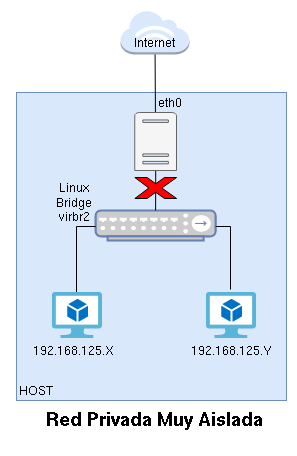

## ¿Qué vas a aprender en esta clase?

* A conocer los distintos de tipos de redes virtuales que podemos gestionar con QEMU/KVM/libvirt.
* A definir los distintos tipos de red.
* A configurar nuevas conexiones de red en las máquinas virtuales. 

## Teoría

* Tenemos dos grandes grupos de redes que podemos configurar:

  * **Redes Virtuales (Privadas)**: Son **redes privadas** que podemos configurar para que tengan distintas características.
  * **Redes Puente (Públicas)**: Las podemos considerar como **redes públicas**, desde el punto de vista que las máquinas virtuales estarán conectadas a la misma red a la que está conectada el host.

* Recordemos un **puente o bridge/switch** es un dispositivo de interconexión de redes. La gestión de redes de libvirt se basa en el concepto de **switch virtual**, para ello utiliza **Linux Bridge**, que es un software que nos permite crear bridge virtuales con la misma funcionalidad que un bridge físico.

### Redes Virtuales (Privadas)

* **Redes Virtuales de tipo NAT**

  Es una Red Virtual Privada, las máquinas virtuales tendrán un direccionamiento privado y se nos proporciona un mecanismo de **router/nat** para que tengan conectividad al exterior.

  

  La red `default` con la que hemos trabajado es de este tipo. Veamos sus características:

  * Crea un bridge virtual donde se conectan las máquinas virtuales. En el caso de la red `default` se llama `vmbr0`. A este bridge también está conectado el host.
  * Las máquinas virtuales se configurarán de forma dinámica por medio de un servidor DHCP. En el caso de la red `default`, el **rango de direcciones** es `192.168.122.2` - `192.168.122.254`. La **puerta de enlace** de las máquinas se configura con la dirección IP `192.168.122.1` que corresponde al host. El **servidor DHCP** está configurado en el host. 
  * En el host también se configura un **servidor DNS** que es el que se configura en las máquinas virtuales.
  * El host hace la función de **router/nat** de tal manera que las máquinas virtuales tienen conectividad al exterior, usando la dirección IP de la interfaz de red del host que está conectada al exterior.

* **Redes Virtuales aisladas (Isolated)**

  Es una Red Virtual Privada, donde las máquinas virtuales tomas direccionamiento privado. No tenemos un mecanismo de router/nat, por lo que las máquinas virtuales no tienen conectividad con el exterior.

  

  Por lo tanto, tienen las mismas características que una Red Virtual de tipo NAT, pero sin la característica de router/nat. Se gestiona un bridge virtual donde se conectan las máquinas virtuales y el host, seguimos teniendo un servidor DNS y es posible tener un servidor DHCP en el host que asigna dinámicamente un direccionamiento privado a las máquinas.
  
* **Redes Virtuales muy aisladas (Very Isolated)**

  Es una Red Virtual Aislada, en la que el host no está conectado a las máquinas virtuales. Por lo tanto, no tenemos servidor DNS ni DHCP para ser utilizados por las máquinas. Al ser aislada, tampoco tienen salida al exterior.

  

  En este tipo de red se suele configurar la red de las máquinas virtuales de forma estática.

## Recursos

* Curso completo: [Introducción a la virtualización con KVM/libvirt usando virt-manager](https://github.com/josedom24/curso_kvm_ow/tree/main/curso1)
* En concreto el apartado:
  * Gestión de redes en virt-manager

## Ejercicio

1. Para hacer este ejercicio necesitamos dos máquinas virtuales. La primera máquina virtual será la que creamos en la clase anterior. La segunda máquina virtual será una máquina con el sistema operativo Windows para ello puedes seguir la documentación del curso: [Creación de máquinas virtuales Windows (1ª parte)](https://github.com/josedom24/curso_kvm_ow/blob/main/curso1/contenidos/unidad03/clase5.md) y [Creación de máquinas virtuales Windows (2ª parte)](https://github.com/josedom24/curso_kvm_ow/blob/main/curso1/contenidos/unidad03/clase6.md).
  * Recuerda que hay que configurar el disco duro y la tarjeta de red como como dispositivio **VirtIO** y por lo tanto tienes que utilizar los driver que encontrarás en la ISO de los drivers VirtIO.
2. Siguiendo el apartado [Definición de redes](https://github.com/josedom24/curso_kvm_ow/blob/main/curso1/contenidos/unidad06/clase2.md) crea una red de cada tipo: NAT, aislada (sin DHCP) y muy aislada.
3. Siguiendo el apartado [Configuración de red en las máquinas virtuales](https://github.com/josedom24/curso_kvm_ow/blob/main/curso1/contenidos/unidad06/clase4.md) conecta las dos máquinas virtuales a la **red NAT** que has creado. Te puedes guiar por el [Ejemplo 2: Trabajando con redes virtuales privadas](https://github.com/josedom24/curso_kvm_ow/blob/main/curso1/contenidos/unidad06/clase6.md). Responde a estas preguntas:
  * ¿Qué tipo de configuración de red has necesitado (estática o dinámica)?
  * ¿Qué configuración de red han tomado cada máquina?
  * ¿Tiene conectividad con el exterior? ¿Tiene resolución DNS? ¿Cuál es el servidor DNS?
  * ¿Hay conectividad entre las máquinas?
  * ¿Hay conectividad con el host?
4. Siguiendo el apartado [Configuración de red en las máquinas virtuales](https://github.com/josedom24/curso_kvm_ow/blob/main/curso1/contenidos/unidad06/clase4.md) conecta las dos máquinas virtuales a la **red aislada** que has creado. Te puedes guiar por el [Ejemplo 2: Trabajando con redes virtuales privadas](https://github.com/josedom24/curso_kvm_ow/blob/main/curso1/contenidos/unidad06/clase6.md). Responde a las preguntas del apartado anterior.
5. Siguiendo el apartado [Configuración de red en las máquinas virtuales](https://github.com/josedom24/curso_kvm_ow/blob/main/curso1/contenidos/unidad06/clase4.md) conecta las dos máquinas virtuales a la **red muy aislada** que has creado. Te puedes guiar por el [Ejemplo 2: Trabajando con redes virtuales privadas](https://github.com/josedom24/curso_kvm_ow/blob/main/curso1/contenidos/unidad06/clase6.md). Responde a las preguntas del apartado anterior.