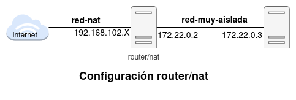

## ¿Qué vas a aprender en esta clase?

* Realiza la configuración de un router Linux
* Activar el reenvío de paquetes.
* Configurar reglas SNAT y DNAT.

## Teoría

* **¿Para qué se usa un router Linux?**

* Para **conectar dos o más redes** y permitir el **enrutamiento de paquetes** entre ellas.
* Útil en redes domésticas, laboratorios o firewalls personalizados.
* Puede realizar funciones como:
  * NAT (traducción de direcciones).
  * Filtrado de paquetes.
  * Redirección de puertos.
  * Compartir conexión a Internet.

* **Habilitar el reenvío de IPs (IP Forwarding)**: Permite que el kernel reenvíe paquetes entre interfaces de red.
    * Comando temporal: `echo 1 > /proc/sys/net/ipv4/ip_forward`
    * Para hacerlo **persistente**:  Editar el archivo `/etc/sysctl.conf` y añadir o descomentar `net.ipv4.ip_forward = 1`. Y ejecutar: `sysctl -p`.
* **SNAT (Source NAT)**: Se usa para **salir a Internet** desde una red local con IPs privadas. Cambia la **IP de origen** de los paquetes por la IP pública del router.

    * Con `iptables`:

    ```bash
    iptables -t nat -A POSTROUTING -o eth0 -s 192.168.0.0/24 -j SNAT --to-source 192.0.2.1
    ```

    * `eth0`: interfaz de salida (por ejemplo, hacia Internet).
    * `-s`: Se indica la red desde la que queremos tener acceso a internet.
    * `192.0.2.1`: IP pública del router.

    * Alternativa más sencilla (masquerade) si se usa IP dinámica:

    ```bash
    iptables -t nat -A POSTROUTING -o eth0 -s 192.168.0.0/24 -j MASQUERADE
    ```
* **DNAT (Destination NAT)**: Se usa para **redirigir tráfico entrante** desde el exterior a una máquina interna. Cambia la **IP de destino** de los paquetes.
    * Con `iptables`:

      ```bash
      iptables -t nat -A PREROUTING -i eth0 -p tcp --dport 80 -j DNAT --to-destination 192.168.1.100:80
      ```

    * Redirige el puerto 80 entrante a una máquina interna con IP 192.168.1.100.


* **Hacer reglas `iptables` persistentes**: Las reglas de `iptables` no sobreviven a un reinicio, se deben guardar. Lo más sencillo para hacerla persistente es usar el paquete `iptables-persistent` (Debian/Ubuntu):
    * Guarda las reglas actuales:

    ```bash
    iptables-save > /etc/iptables/rules.v4
    ```
    * Se restauran automáticamente al iniciar el sistema.

# Recursos

* El [Ejemplo 3: Configuración de un router/NAT](https://github.com/josedom24/curso_kvm_ow/blob/main/curso1/contenidos/unidad06/clase7.md) del curso de virtualización.

## Ejercicio

Crea un escenario similar al que encuentras en el Ejemplo 3:



Llamaremos a las máquinas de la siguiente manera: 

* La máquina router/nat la llamaremos `router.tunombre.org`.
* La máquina interna la llamaremos `interna.tunombre.org`.

Realiza las siguientes tareas:

1. Configura de forma estática las interfaces de red de las máquinas que están conectas a la red muy aisladas, comprueba que hay conectividad entre ellas.
2. Configura el FQDN de forma correcta en las dos máquinas.
3. Crea un usuario llamado `tunombre` que tenga permisos para ejecutar `sudo` sin que te pida contraseña en las dos máquinas.
4. Configura el acceso a las dos máquinas por shh con tu clave pública para acceder con el usuario que has creado. Investiga el uso de `ssh -A` para acceder a la máquina interna desde el exterior. 
5. Configura la máquina router para que permita que la máquina interna tenga acceso a internet. Las reglas que has configurado deben ser persistentes.
6. Instala un servidor web en la máquina interna: `sudo apt install apache2`. Crea la regla necesaria para acceder desde el exterior al servidor web con un navegador. Usa resolución estática para acceder a la página web usando el nombre `www.tunombre.org`.


## Entrega

1. Configuración de red de las dos máquinas. Comprobación de que las máquinas hacen ping.
2. Comprobación de que el nombre FQDN está bien configurado.
3. Comprobación de que al ejecutar sudo no se pide la contraseña.
4. Comprobación del acceso a las dos máquinas con ssh.
5. Comprobación de que la máquina interna tiene acceso a internet y resolución DNS.
6. Comprobación del acceso a la página web con un navegador desde el exterior.

<div class="notice--info">{{ notice-text | markdownify }}</div>

