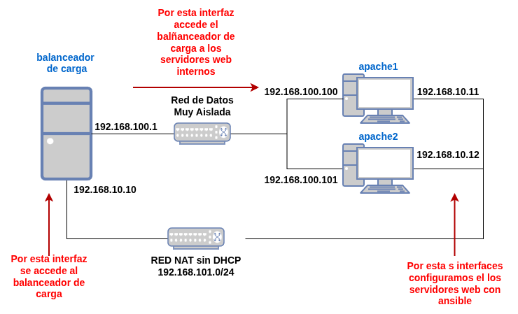

## ¿Qué vas a aprender en esta clase?

* Vamos a aprender el concepto de balanceador de carga.
* Vamos a montar un escenario usando Vagrant y Ansible.
* Vamos a configurar HaProxy como balanceador de carga.
* Vamos a comprobar el aumento de rendimiento que obtenemos al usar un balanceador de carga.

## Recursos

Los contenidos necesarios para la realización de este ejercicio y para profundizar en la configuración de nginx, lo puedes encontrar en el siguiente apartado:

* [Introducción al balanceo de carga con HAProxy](haproxy.html)


## Ejercicios

### Ejercicio 1: Configuración de haproxy

Vamos a usar los ficheros del **escenario4** del repositorio [opentofu-libvirt](https://github.com/josedom24/opentofu-libvirt/tree/main) para crear un escenario para trabajar con el balanceador de carga. Para ello crea el escenario y posteriormente pasa el playbook de ansible.

En este escenario los servidores web ejecutan php, y se ha copiado en el DocumentRoot un fichero `app.php` que utilizaremos posteriormente.



Instala en el servidor `balanceador` el balanceador haproxy y configúralo de manera adecuada para balancear la carga entre los dos servidores web `apache1` y `apache2`. Instala también la utilidad `hatop` para controlar el balanceo.

Configura la resolución estática para acceder al balanceador con el nombre `www.example.org`.


* **Tarea 1**: Entrega capturas de pantalla que el balanceador está funcionando.
* **Tarea 2**: Entrega una captura de pantalla donde se vea la página web de estadísticas de haproxy (abrir en un navegador web la URL `http://www.example.org/ha_stats`).
* **Tarea 3**: Desde uno de los servidores (`apache1` o `apache2`), verificar los logs del servidor Apache. En todos los casos debería figurar como única dirección IP cliente la IP interna de la máquina balanceador `192.168.100.1`. ¿Por qué?
<div class="notice--info">{{ notice-text | markdownify }}</div>

### Ejercicio 2: Aumento de rendimiento usando el balanceo de carga

Como estamos repartiendo las peticiones entre varios servidores web, el rendimiento (**número de peticiones respondidas por segundos**) aumenta.

La utilidad [ab](http://httpd.apache.org/docs/2.4/programs/ab.html) (Apache Benchmark) sirve para hacer pruebas de carga a un servidor web. Es un programa que forma parte del paquete `apache2-utils`.

Vamos a usar `ab` para comprobar cuantas peticiones por segundos se responden. Por ejemplo:

```
ab -n 1000 -c 100 http://www.example.org/app.php
```
El anterior comando simula 100 usuarios al mismo tiempo haciendo 1000 peticiones. Lo realizamos sobre el fichero `app.php` que tiene ejecuta un proceso (cálculo del número pi) muy costosos computacionalmente.

De la salida nos interesa el parámetro `Requests per second:`, que nos da el numero de peticiones servidas por segundos.


* **Tarea 1**: Con `hatop` habilita un solo nodo de balanceo, ejecuta la prueba y comprueba cuantas peticiones por segundos se responden. Entrega una captura donde se vea que sólo un nodo está habilitado, y la salida de la prueba.
* **Tarea 2**: Habilita los dos nodos y vuelve a realizar la prueba. ¿Han subido las peticiones por segundos respondidas? Entrega las mimas capturas de pantalla que en el punto anterior.
* **Tarea 3**: Modifica el escenario Vagrant y el playbook de ansible para añadir otro servidor web `apache3`. Habilita los tres nodos en el balanceo y realiza la prueba. ¿Han subido las peticiones por segundos respondidas? Entrega las mimas capturas de pantalla que en el punto anterior.
<div class="notice--info">{{ notice-text | markdownify }}</div>
