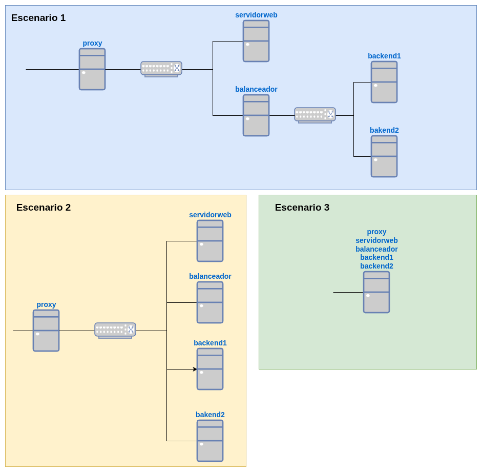

En esta práctica vamos a trabajar con las distintas aplicaciones que hemos estudiado que utilizan el protocolo HTTP: **servidor web, proxy inverso y balanceador de carga**. Vamoos a configurar un proxy inverso que nos permite el acceso a diferentes aplicaciones web. Algunas de las aplicaciones web se sirven desde un servidor web y otras se sirven desde un balanceador de carga.

## Infraestructura

Podemos hacer la práctica en varios escenarios distintos:

* **Escenario 1**: Es más real, tenemos cada servidor en una red privada.
* **Escenario 2**: En este caso todos los servidores están en la misma red.
* **Escenario 3**: En este caso sólo tenemos dos servidores web, uno de ellos será backend para el balanceador de cargar y servidor web para el acceso desde el proxy inverso.
* **Escenario 4**: Todos los servicios están en un servidor, habrá que trabajar con los puertos.



Elige el escenario que más te guste.

## Configuración de servicios

### Servidor web

* Elige entre el servidor web apache2 o nginx.
* Tendrá una página principal con hoja de estilo, con distinta información (tu nombre, ...).
* Cuando se accede a la ruta `/nas` se redirecciona a `/documentos`.
* En la ruta `/documentos` hay una autentificación básica.
* Cuando nos autentificamos, nos muestra una página con documentos pdf que se pueden descargar.
* Esta página será accesible desde el proxy inverso con la url `nas.tunombre.org`.

El servidor web tendrá además dos aplicaciones web implantadas en contenedores docker:

* Una aplicación **mediawiki** que será accesible desde el proxy inverso con el nombre `www.tunombre.org/wiki`.
* Una aplicación **ghost** que será accesible desde el proxy inverso con el nombre `www.tunombre.org/blog`.

## Balanceador de carga

* En el escenario 1 tendrá qué funciona como router/nat.
* Instalaremos `haproxy` y balanceara la carga sobre los servidores `backend1` y `backend2`.
* En los servidor web instalaremos una aplicación PHP con hoja de estilo, que tendrá en el cuero de la página, el siguiente código PHP para que muestre los nombres de los servidores en los que está accediendo:
    ```php
    <?php
    // Mostrar el hostname del servidor
    echo "<h1>Servidor: " . gethostname() . "</h1>";

    // Información adicional opcional (útil para diagnóstico)
    echo "<p>Dirección IP del servidor: " . $_SERVER['SERVER_ADDR'] . "</p>";
    echo "<p>Dirección IP del cliente: " . $_SERVER['REMOTE_ADDR'] . "</p>";
    echo "<p>Fecha y hora: " . date('Y-m-d H:i:s') . "</p>";
    ?>
    ``` 
* La página balanceada será accesible desde el proxy inverso con la url `app.tunombre.org`.

## Proxy inverso

* En el escenario 1 y en el escenario 2 tendrá qué funciona como router/nat.
* Elige entre el servidor web apache2 o nginx.
* Las url y las páginas a las que vamos a acceder son:
    * `nas.tunombre.org`: Accederemos al servidor web.
    * `www.tunombre.org/wiki`: Accedemos a la aplicación docker `mediawiki`.
    * `www.tunombre.org/blog`: Accedemos a la aplicación docker `ghost`.
    * `app.tunombre.org`: Accedemos a al balanceador de carga.




## Entrega

1. Indica el escenario que has escogido.
2. Configuración del balanceador de carga y del proxy inverso.
3. Comprobación de que se produce una redireción al acceder a la aplicación web `nas.tunombre.org` desde el proxy inverso.
4. Capturas de pantallas accediendo a las distintas aplicaciones.
5. Captura de pantalla accediendo con `hatop` al balanceador de carga.
<div class="notice--info">{{ notice-text | markdownify }}</div>


## netplan en lxc debian/ubuntu

En los contenedores LXC con el sistema operativo Debian, tenemos `systemd-netword` para configurar nuestras interfaces de red. Para facilitar la configuración de red podemos instalar `netplan`:

```
apt install netplan.io
```

Y creamos un fichero de configuración de `netplan`, por ejemplo `/etc/netplan/10-lxc.conf`. Recuerda que este fichero debe tener permisos restrictivos: `chmod 600`.

El problema surge cuando ejecutamos `netplan apply` que nos da un error. Ese error está causado por el componente `udev` no está instalado en los contenedores LXC. Lo que podemos hacer es simular que ese componente está instalado, ejecutando:

```
mkdir -p /usr/local/bin
echo -e '#!/bin/sh\nexit 0' > /usr/local/bin/udevadm
chmod +x /usr/local/bin/udevadm
```
Y ya podremos usar `netplan` cono herramienta para configurar la red.