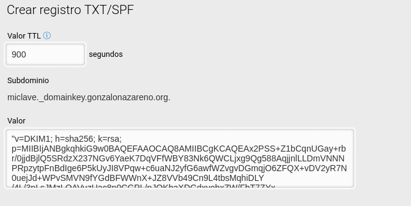
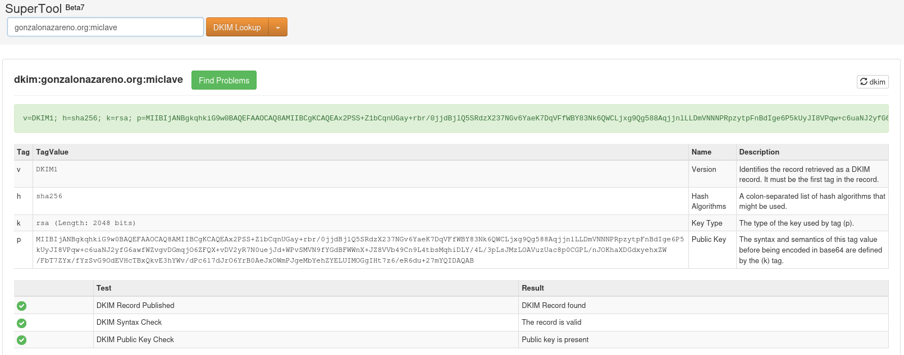

## SPF

En el diseño original del correo electrónico, **cualquier máquina puede enviar mensajes de correo a cualquier destino utilizando cualquier remitente**. Esta flexibilidad permite, por ejemplo, que un mismo servidor envíe correos usando distintos remitentes, pero también ha sido ampliamente utilizada para el envío masivo de correo no deseado (*spam*) y para la **suplantación de identidad del remitente** (*email spoofing*).

Debido a estos problemas, se han generalizado mecanismos adicionales de autenticación que permiten a los servidores de correo comprobar si el origen de un mensaje es legítimo. Hoy en día, la mayoría de servidores de correo **rechazan o clasifican como spam** los mensajes que provienen de dominios que no implementan algún mecanismo de autenticación.

**Sender Policy Framework (SPF)** es un mecanismo de autenticación que, mediante un **registro DNS de tipo TXT**, indica qué servidores están autorizados a enviar correo en nombre de un determinado dominio. Muchos servidores de correo exigen como mínimo la existencia de un registro SPF; en caso contrario, los mensajes pueden ser rechazados o enviados directamente a la carpeta de spam.

### Funcionamiento de SPF

De forma simplificada, el proceso de comprobación SPF es el siguiente:

1. Un servidor de correo recibe un mensaje.
2. Obtiene la **dirección IP del servidor emisor**.
3. Consulta el **registro SPF del dominio remitente**.
4. Comprueba si la IP está autorizada.
5. Decide si acepta el mensaje, lo marca como spam o lo rechaza.

Es importante destacar que **SPF no autentica al usuario ni al contenido del mensaje**, sino únicamente **al servidor que envía el correo**.

### Ejemplo de registro SPF

Un registro SPF se define mediante un registro TXT en el DNS del dominio. Un ejemplo sería el siguiente:

```

DOMINIO. 600 IN TXT "v=spf1 a mx ip4:X.X.X.X/32 ip6:XXXX:XXXX:XXXX::XXXX:XXXX/128 -all"

```

Este registro define qué direcciones IP y nombres DNS están autorizados a enviar correo en nombre del dominio. Los mecanismos más habituales son:

- **a**: autoriza las direcciones IP asociadas a los registros A del dominio.
- **mx**: autoriza las direcciones IP a las que apuntan los registros MX del dominio.
- **ip4**: autoriza direcciones IPv4 concretas.
- **ip6**: autoriza direcciones IPv6 concretas.
- **include**: incluye las políticas SPF definidas en otro dominio (muy habitual cuando se usan servicios externos).

Para el dominio `gonzalonazareno.org` el servidor de correos es `macaco.gonzalonazareno.org` y tiene la dirección IP `5.39.73.79`, el registro SPF podría ser:

```
dig txt gonzalonazareno.org
...
gonzalonazareno.org. 0 IN TXT "v=spf1 ip4:5.39.73.79 ~all"
```

### El modificador `all`

El modificador `all` indica qué debe hacer el servidor receptor si el correo proviene de una dirección no autorizada en el registro SPF. Puede ir precedido de distintos prefijos:
- **-all**: el mensaje debe ser rechazado.
- **~all**: el mensaje se acepta pero se marca como sospechoso o spam.
- **?all**: el resultado es neutro (equivalente a no usar SPF).

De esta forma, los correos enviados desde los servidores autorizados pasarán la validación SPF y tendrán una menor probabilidad de ser clasificados como spam.


## DKIM

**DomainKeys Identified Mail (DKIM)** es un mecanismo de autenticación cuyo objetivo principal es **evitar la suplantación del remitente y garantizar la integridad de los mensajes de correo electrónico**. DKIM permite al servidor receptor comprobar que un mensaje no ha sido modificado durante el transporte y que está asociado a un dominio concreto.

El funcionamiento de DKIM se basa en criptografía de clave pública. El servidor de correo emisor **firma los mensajes con una clave privada**, mientras que la **clave pública se publica en el DNS** del dominio. El servidor receptor puede obtener dicha clave pública y verificar la firma de cada mensaje recibido.

Es importante destacar que **DKIM no autentica al servidor emisor**, sino **al mensaje**, complementando así el mecanismo SPF, que sí valida la dirección IP del servidor que envía el correo.

### Instalación de OpenDKIM

Para configurar DKIM en nuestro servidor de correo utilizaremos **OpenDKIM**. Instalamos los paquetes necesarios:

```
apt install opendkim opendkim-tools
```

### Generación de las claves DKIM

A continuación, generamos el par de claves (privada y pública). Para ello ejecutamos el siguiente comando:

```
sudo -u opendkim opendkim-genkey -D /etc/dkimkeys -d midominio.algo -s miclave
```

Donde:
* `-D /etc/dkimkeys` indica el directorio donde se guardarán las claves.
* `-d midominio.algo` es el dominio para el que se generan las claves.
* `-s miclave` es el **selector**, un identificador que permite gestionar varias claves para un mismo dominio.

Tras ejecutar el comando, se crean dos ficheros:

* **miclave.private**: contiene la clave privada, utilizada para firmar los mensajes.
* **miclave.txt**: contiene la clave pública, que se publicará en el DNS.

Es fundamental que la clave privada solo sea accesible por el usuario `opendkim`, ya que protege la firma de los mensajes.

### Configuración de OpenDKIM

Editamos el fichero `/etc/opendkim.conf` y configuramos los siguientes parámetros:

```

Mode                    sv
Domain                  midominio.algo
KeyFile                 /etc/dkimkeys/miclave.private
Selector                miclave
Socket                  inet:8892@localhost

```

Donde:
* `Mode sv` indica que OpenDKIM firmará los correos salientes (*signing*) y verificará los entrantes (*verification*).
* `Domain` es el dominio que firmará los mensajes.
* `KeyFile` indica la ruta a la clave privada.
* `Selector` es el identificador de la clave.
* `Socket` define el puerto por el que Postfix se comunicará con OpenDKIM.

### Integración de OpenDKIM con Postfix

Para que Postfix utilice OpenDKIM, añadimos las siguientes líneas al fichero `/etc/postfix/main.cf`:

```
milter_protocol = 2
milter_default_action = accept
smtpd_milters = inet:localhost:8892
non_smtpd_milters = $smtpd_milters
```

Esto permite que Postfix envíe los mensajes a OpenDKIM para que sean firmados antes de su envío.

A continuación, reiniciamos los servicios:

```
systemctl restart opendkim
systemctl restart postfix
```

### Publicación de la clave pública en DNS

Para que los servidores receptores puedan verificar la firma DKIM, es necesario publicar la clave pública en el DNS del dominio. Para ello, visualizamos el contenido del fichero generado:

```
cat miclave.txt
```

El contenido será similar a:

```
miclave._domainkey IN TXT "v=DKIM1; h=sha256; k=rsa; p=MIIBIjANBgkqhkiG9w0BAQEFAAOCAQ8A..."

```

Debemos crear un **registro TXT** en el DNS con:
* **Nombre**: `miclave._domainkey.midominio.algo`
* **Valor**: el contenido desde `v=DKIM1` hasta el final, todo en **una sola línea**, sin comillas.

Por ejemplo, para el registro de `gonzalonazareno.org` sería:



### Verificación de DKIM

Una vez configurado el DNS, podemos verificar que el registro DKIM es correcto utilizando [herramientas externas](https://mxtoolbox.com/dkim.aspx) de comprobación, que permiten validar la firma y el registro DNS de forma sencilla.



DKIM garantiza que el mensaje no ha sido modificado desde que fue firmado, pero **no indica qué hacer si la verificación falla**. Esta decisión se define mediante **DMARC**, que veremos en el siguiente apartado.

## DMARC

**DMARC** (*Domain-based Message Authentication, Reporting and Conformance*) es un mecanismo que **complementa y amplía el funcionamiento de SPF y DKIM**. DMARC no autentica por sí mismo, sino que permite al administrador de un dominio **definir una política** que indica cómo deben tratarse los correos que no superan las comprobaciones de SPF y/o DKIM.

Mediante la publicación de un registro DNS, DMARC indica:
* si el dominio utiliza SPF, DKIM o ambos,
* qué hacer con los mensajes que no superan estas comprobaciones,
* y dónde enviar informes sobre el resultado de las validaciones.

### Configuración de DMARC

La configuración de DMARC se realiza mediante un **registro DNS de tipo TXT** asociado al subdominio `_dmarc`. Un ejemplo de registro DMARC sería el siguiente:

```
_dmarc.DOMINIO. 3600 IN TXT "v=DMARC1; p=quarantine; adkim=r; aspf=r; rua=mailto:correo@DOMINIO"
```

En este registro se define la política que deben aplicar los servidores de correo receptores cuando un mensaje no cumple con SPF y/o DKIM.

### Parámetros principales

- **p**: indica la política a aplicar (parámetro obligatorio).
  - `p=none`: no se aplica ninguna acción, los correos se aceptan igualmente.
  - `p=quarantine`: los correos que no superan las comprobaciones se tratan como sospechosos o spam.
  - `p=reject`: los correos que no superan las comprobaciones se rechazan.

- **adkim**: indica el modo de alineación DKIM.
  - `adkim=s` (estricto): el dominio del campo `From:` debe coincidir exactamente con el dominio firmado por DKIM.
  - `adkim=r` (relajado): el dominio del `From:` puede ser un subdominio del dominio firmado.

- **aspf**: indica el modo de alineación SPF.
  - `aspf=s`: alineación estricta.
  - `aspf=r`: alineación relajada.

- **rua**: dirección de correo a la que se envían los **informes agregados DMARC**, que permiten analizar el resultado de las validaciones realizadas por los servidores receptores.

El único parámetro obligatorio es **p**, aunque es recomendable definir también `adkim`, `aspf` y `rua`.

### Alineación en DMARC

Un concepto clave en DMARC es la **alineación** (*alignment*). No basta con que SPF o DKIM superen la validación; además, deben estar **alineados con el dominio del campo `From:`** visible para el usuario.

Esto evita que un atacante pueda enviar correos válidos desde un servidor autorizado pero utilizando un dominio diferente en el remitente.

### Funcionamiento de DMARC

El proceso de validación DMARC es el siguiente:

* Si el correo **supera SPF o DKIM** y además está **alineado**, DMARC considera el mensaje válido.
* Si **fallan ambos mecanismos**, DMARC aplica la política configurada (`none`, `quarantine` o `reject`).

De este modo, DMARC permite al propietario del dominio **controlar cómo deben tratarse los correos no válidos**, reduciendo la suplantación de identidad y protegiendo la reputación del dominio.

### Ejemplo real

El registro DMARC del dominio `gonzalonazareno.org` es el siguiente:

```

dig txt _dmarc.gonzalonazareno.org
...
_dmarc.gonzalonazareno.org. 0 IN TXT "v=DMARC1; p=quarantine; adkim=r; aspf=r;"

```
### Resumen

- **SPF** indica qué servidores pueden enviar correo en nombre de un dominio.
- **DKIM** garantiza la integridad del mensaje mediante una firma digital.
- **DMARC** define la política a aplicar cuando SPF y/o DKIM fallan.

La combinación de estos tres mecanismos es esencial para garantizar que el correo enviado desde nuestro dominio llegue a destino y no sea rechazado o clasificado como spam.



## Práctica 1/2

Ejercicio 1: Envío de correos


<div class="notice--warning">{{ notice-text | markdownify }}</div>