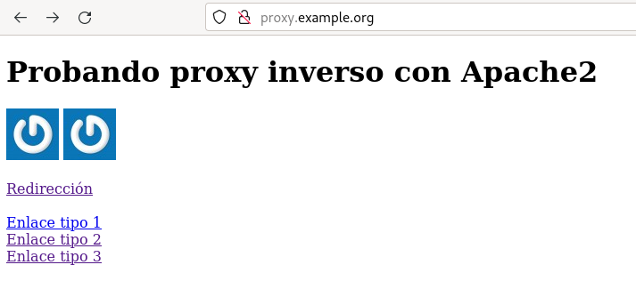

Un proxy inverso es un tipo de servidor proxy que recupera recursos en nombre de un cliente desde uno o más servidores. Por lo tanto el cliente hace la petición al puerto 80 del proxy (o al puerto 443 si usamos https), y éste es el que hace la petición al servidor web que normalmente está en una red interna no accesible desde el cliente.


## Apache como proxy inverso

Apache2.4 puede funcionar como proxy inverso usando el módulo `proxy` junto a otros módulos, por ejemplo:

  * proxy_http: Para trabajar con el protocolo HTTP.
  * proxy_ftp: Para trabajar con el protocolo FTP.
  * proxy_html: Permite reescribir los enlaces HTML en el espacio de direcciones de un proxy.
  * proxy_ajp: Para trabajar con el protocolo AJP para Tomcat.
  * &#8230;

## Ejemplo de utilización de proxy inverso

 Vamos a usar los ficheros del directorio `apache2_proxy_inverso` del repositorio [taller_http](https://github.com/josedom24/taller_http) para crear la infraestructura con vagrant. Se va a crear un servidor interno (no accesible desde el cliente) con una dirección privada, con el nombre de `interno.example.org`.  Tenemos un servidor que va a funcionar de proxy, llamado `proxy.example.org` con dos interfaces de red: una pública conectada a la red donde se encuentra el cliente (será la red de mantenimiento), y otra interna conectada a la red donde se encuentra el servidor interno.

Vagrant ha configurado los siguiente:

* En el servidor `proxy` ha instalado apache2, ha configurado el router-nat y ha escrito en la resolución estática el nombre del servidor interno.
* En el servidor web interno se ha instalado apache2, se ha cambiado la ruta por defecto para salir por el proxy, se ha copia una página web, se ha configurado una redirección con un fichero `.htaccess` y por último se ha cambiado la configuración de apache2 para permitir ficheros `.htaccess`.

En nuestro servidor interno hemos creado un virtual host para servir una página estática, `index.html`, con este contenido:

    <!DOCTYPE html>
    <html lang="es">
    <head>
        <meta charset="UTF-8">
        <title>Probando proxy inverso con Apache2</title>
    </head>
    <body>
            <h1>Probando proxy inverso con Apache2</h1>
            
            
            <br/>
            <br/>
            <a href="directorio">Redirección</a>
            <br/><br/>
            <a href="http://10.0.0.6/carpeta/index.html">Enlace tipo 1</a><br/>
            <a href="/carpeta/index.html">Enlace tipo 2</a><br/>
            <a href="carpeta/index.html">Enlace tipo 3</a>
    </body>

**Debemos que recordar que desde el nuestro cliente no tenemos acceso al servidor web interno. Np vamos a usar la IP de la red de mantenimeinto para acceder**.

Por lo tanto necesitamos un proxy inverso:

## Configuración del proxy inverso

En el servidor `proxy` vamos a activar la funcionalidad de proxy inverso. Por lo tanto, para empezar, vamos activar los módulos que necesitamos:

    # a2enmod proxy proxy_http
    
Creamos un viirtualhost para servir el contenido ofrecido con el nombre del host `proxy.example.org`.

Vamos a utilizar la directiva [`ProxyPass`](https://httpd.apache.org/docs/2.4/mod/mod_proxy.html#proxypass) en el fichero de configuración del virtual host, de la siguiente forma:

    ProxyPass "/" "http://interno.example.org/"
    

También lo podemos configurar de forma similar con:

    <Location "/">
        ProxyPass "http://interno.example.org/"
    </Location>
    

Evidentemente debe funcionar la resolución de nombre para que el proxy pueda acceder al servidor interno y para que podamos acceder al proxy. En el fichero `/etc/hosts` del cliente indica la resolución estática usando la IP de la red de mantenimiento del `proxy`:

```
172.22.121.XX	proxy.example.org
```

De esta manera al acceder desde el cliente la URL `http://proxy.example.org/` se mostraría la página que se encuentra en el servidor interno.



Hay que tener en cuenta que las páginas HTML tienen que estar escritas de forma adecuada para permitir ser servidas por un proxy. Veamos los errores que se han presentado:

1. El enlace de tipo 1, nunca va a funcionar poruqe como observamos en el código HTML hace referencia a la IP interna del servidor web interno. No podemos usar referencias absolutas a la IP de un servidor web en los enlaces.
2. La redirección no funciona. Veamos a continuación la solución al problema de las redirecciones.

### El problema de las redirecciones

Cuando creamos una redirección en un servidor web y el cliente intenta acceder al recurso, el servidor manda una respuesta con código de estado `301` o `302`, e indica la URL de la nueva ubicación del recurso en una cabecera HTTP llamada `Location`.

Si hemos configurado una redirección en el servidor interno, cuando se accede al recurso a través del proxy, la redirección se realiza pero la cabecera `Location` viene referencia la dirección del servidor interno, por lo que el cliente es incapaz de acceder a la nueva ubicación. Al acceder a `http://proxy.example.org/web/directorio` se produce una redirección pero como vemos la nueva url hace referencia al servidor interno por lo que no funciona:


Para solucionarlo utilizamos la directiva [`ProxyPassReverse`](https://httpd.apache.org/docs/2.4/mod/mod_proxy.html#proxypassreverse) que se encarga de reescribir la URL de la cabecera `Location`.

La configuración quedaría:

    ProxyPass "/" "http://interno.example.org/"
    ProxyPassReverse "/" "http://interno.example.org/"
    

O de esta otra forma:

    <Location "/">
        ProxyPass "http://interno.example.org/"
        ProxyPassReverse "http://interno.example.org/"
    </Location>
    

Por lo que ya podemos hacer la redirección de forma correcta:


## Proxy inverso usando rutas

Si tuviéramos varios servidores web internos o varias páginas o aplicaciones web a las que tuviéramos que acceder a través del proxy, tendríamos dos opciones:

1. Usar un VirtualHost para cada una de las aplicaciones web y configurarlos como hemos explicado anteriormente.
2. Tener un sólo VirtualHost y configurar distintas rutas para acceder a cada una de las aplicaciones.

Vamos este segundo caso con más detenimiento. Vamos a imaginar que queremos acceder a la página web del servidor interno con la URL `http://proxy.example.org/web/`. En este caso la configuración del proxy cambiaría de la siguiente manera:

    ProxyPass "/web/" "http://interno.example.org/"
    ProxyPassReverse "/web/" "http://interno.example.org/"
    
O de esta otra forma:

    <Location "/web/">
        ProxyPass "http://interno.example.org/"
        ProxyPassReverse "http://interno.example.org/"
    </Location>

De esta manera al acceder desde el cliente la URL `http://proxy.example.org/web/` se mostraría la página que se encuentra en el servidor interno.


Veamos ahora los errores que se han presentado:

1. Como vemos una imagen no se ha cargado. La segunda imagen utiliza una path absoluto, es decir, se espera que la imagen esté en la raíz del DocumentRoot y en este caso estamos accediedndo a la ruta `/web/`: no existe una imagen en la raíz.
2. El enlace de tipo 1 no funciona por la misma razón que vimos anteriormente, pero ahora tampoco funciona el enlace de tipo 2, porque de forma similar a la imagen que no se ve, hace referencia a la raíz del DocumentRoot, y en este caso, como ya hemos dicho, estamos accediendo usando la ruta `/web/`.

Termianmos diciendo que al crear las páginas HTML hay que evitar rutas absolutas donde aparezcan direcciones IP, y también referencias a la raíz del sitio web.

