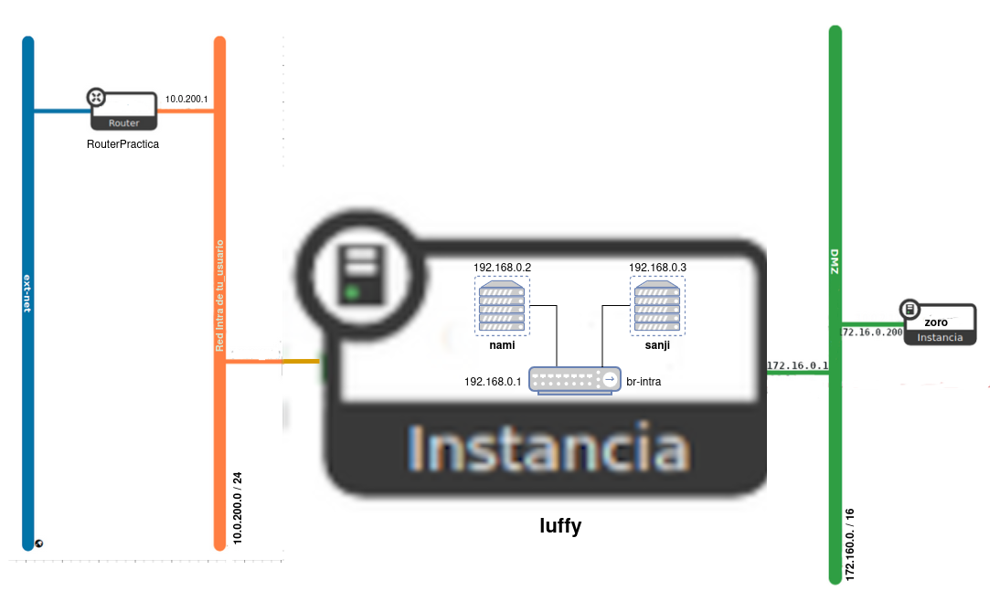

En esta tarea se va a crear el escenario de trabajo que se va a usar durante todo el curso, que va a constar inicialmente de 4 máquinas: 2 instancias en OpenStack y dos contenedores LXC que se ejecutarán en una de las instancias.

Para nombrar las máquinas se va a utilizarlos nombres: **...**.

Además el dominio será un subdominio de la forma `tunombre.gonzalonazareno.org`. De esta forma tendremos:

* Máquina 1: Instancia en OpenStack con Debian 12 Bookworm que se llama `xxx.tunombre.gonzalonazareno.org`.
* Máquina 2: Instancia en OpenStack con Rocky Linux 9 que se llama `yyy.tunombre.gonzalonazareno.org`.
* Máquina 3: Contenedor LXC con Ubuntu 22.04 que se llama `zzz.tunombre.gonzalonazareno.org`.
* Máquina 4: Contenedor LXC con Ubuntu 22.04 que se llama `aaa.tunombre.gonzalonazareno.org`.

La creación y configuración (conexión a las redes, creación de volumen, quitarle la seguridad a los puertos, ...) de la **máquina1 (xxx)** la debes hacer con OSC. Lo demás lo puedes hacer con horizon.

## Escenario

## Instalación de las instancias de OpenStack

1. Crea un nuevo router llamado **RouterPractica** conectado a la red externa.
2. Crea una red interna que se llame **Red Intra de tu_usuario**, con las siguientes características:
	* Está conectada al router que has creado.
	* Direccionamiento: 10.0.200.0/24
	* Con DHCP y DNS (`10.0.200.1`).
3. Crea una red interna que se llame **Red DMZ de tu_usuario**, con las siguientes características:
	* Direccionamiento: 172.16.0.0/16
	* Con DHCP y DNS (`172.22.0.1`).
	* La puerta de enlace de los dispositivos conectados a esta red será el `172.16.0.1`.
4. Las dos instancias que vamos a crear se van a configurar con `cloud-init` de la siguiente manera:
	* Deben actualizar los paquetes de la distribución de la instancia.
	* El dominio utilizado será del tipo `tunombre.gonzalonazareno.org`. Por lo tanto en la configuración con `cloud-init` habrá que indicar el hostname y el FQDN.
	* Se crearán dos usuarios: 
		* Un usuario sin privilegios. Se puede llamar como quieras (pero el nombre será el mismo en todas las máquinas) y accederás a las máquinas usando tu clave ssh privada.
		* Un usuario `profesor`, que puede utilizar `sudo` sin contraseña. Copia de las claves públicas de todos los profesores en las instancias para que puedan acceder con el usuario `profesor`.
	* Cambia la contraseña al usuario `root`.
5. Creación de la **máquina1 (xxx)**:
	* Crea una instancia sobre un volumen de 15Gb, usando una imagen de **Debian 12 Bookworm**. Elige el sabor `vol.medium`. Y configuralá con `cloud-init` como se ha indicado anteriormente.
	* Está instancia estará conectada a la red **Red Intra de tu_usuario**. Asigna a la instancia una IP flotante.
6. Configuración de la **máquina1 (xxx)**:
	* Conecta la instancia a tu **Red DMZ**, asígnale la dirección `172.16.0.1` para que sea la puerta de enlace las máquinas conectadas a esta red.
	* Deshabilita la seguridad de los puertos en las dos interfaces de red para que funcione de manera adecuada el NAT.
	* Configura de forma permanente la regla SNAT para que las máquinas de la **Red DMZ** tengan acceso a internet.
7. Creación de la **máquina2 (yyy)**:
	* Está instancia se conectará a la **Red DMZ**. Usando un puerto asigna a esta máquina la dirección `172.16.0.200`.
	* Crea una instancia sobre un volumen de 15Gb, usando una imagen de **Rocky Linux 9**. Elige el sabor `vol.normal`. Y configúrala con `cloud-init` como se ha indicado anteriormente.
	* Deshabilita la seguridad de los puertos en la interfaz de red para que funcione de manera adecuada el NAT.
	* Comprueba que tiene acceso a internet. **Si no tiene acceso a internet, no se han actualizado los paquetes con cloud-init, hazlo posteriormente.**.

## Instalación de los contenedores

En **maquina1** vamos a crear dos contenedores en un red interna, para ello:
1. Crea en **máquina1 (xxx)** un linux bridge llamado `br-intra` (no lo hagas con `virsh` ya que se configura una reglas de cortafuego muy estrictas) y asigna una dirección IP estática `192.168.0.1`. Esta será la IP de **máquina1 (xxx)** conectada a este switch virtual y será la puerta de enlace de los contenedores. Tienes que tener en cuenta que la imagen de Debian 12 Bookworm de OpenStack tiene **netplan** para la configuración de las redes, por lo tanto tienes que configurar el bridge usando el fichero de configuración de netplan, para ello te puede ser útil esta [página](https://fabianlee.org/2022/09/20/kvm-creating-a-bridged-network-with-netplan-on-ubuntu-22-04/). No olvides poner la mtu a 1450 al crear el bridge.
2. Instala LXC y crea dos contenedores con la distribución **Ubuntu 22.04**. Estos contenedores serán la **máquina3 (zzz)** y la **máquina4 (aaa)**.
3. Configura de forma permanente la regla SNAT para que los contenedores tengan acceso a internet.
4. Conecta los contenedores al bridge `br-intra` y configúralo de forma estática con las siguientes direcciones: **máquina3 (zzz)** la `192.168.0.2` y **máquina4 (aaa)** la `192.168.0.3`. Su DNS será el `172.22.0.1`.
5. Para que la red de OpenStack funcione de forma adecuada las imágenes que usamos tienen configurado la mtu (*Unidad máxima de transferencia*) a 1450 bytes. Tenemos que adecuar los contenedores a este tamaño de trama. Para ello introduce en la configuración de los contenedores la línea: `lxc.net.0.mtu = 1450`.
6. Configura los contenedores para que se auto inicien al reiniciar la instancia. 
7. Los contenedores tendrán características parecidas a las instancias anteriormente:
	* Debes actualizar los paquetes de la distribución instalada.
	* El dominio utilizado será del tipo `tunombre.gonzalonazareno.org`. Por lo tanto configura de manera adecuda el hostname y el FQDN.
	* Para acceder a los contenedores vamos a usar ssh.
	* Crea dos usuarios: 
		* Un usuario sin privilegios. Se puede llamar como quieras (el nombre de usuario que usaste en las instancias) y accederás a los contenedores usando tu clave ssh privada.
		* Un usuario `profesor`, que puede utilizar `sudo` sin contraseña. Copia de las claves públicas de todos los profesores en los contenedores para que puedan acceder con el usuario `profesor`.
	* Cambia la contraseña al usuario `root`.

## Entrega

1. Las instrucciones para crear el router y las redes.
2. Las instrucciones para crear y configurar la **máquina1 (xxx)**.
3. Los ficheros `cloud-config.yaml` que has usado para crear las instancias.
4. La IP flotante de la **máquina1 (xxx)**.
5. Una captura de pantalla donde se vea el esquema de red en Horizon que has creado.
6. Prueba de funcionamiento de qué los FQDN están bien configurados.
7. Prueba de funcionamiento de que se pueden acceder a todas las máquinas por ssh.
8. Prueba de funcionamiento de que las máquinas tienen acceso a internet.


{{ notice-text | markdownify }}

