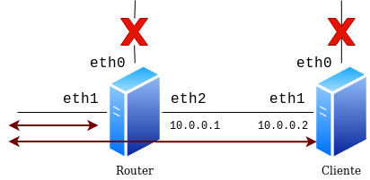

Queremos automatizar la creación de la siguiente infraestructura usando Vagrant, el esquema que queremos desarrollar, que vemos en la imagen, tiene las siguientes características:

* Es escenario tiene dos máquinas: 
  * `router`, que está conectada a una red publica y a una red privada (muy aislada). La interfaz de red en la red privada se configura con la IP `10.0.0.1`.
  * `cliente`: Esta máquina está conectada a la misma red privada que la máquina anterior, en este caso su direccionamiento es `10.0.0.2`.


## Entrega

**En este ejercicio sólo vamos a construir el escenario. No vamos a configurarlo.**

1. El fichero `Vagrantfile` que construya el escenario. 
2. Una captura de pantalla donde se vea un ping de la máquina `cliente` a la máquina `router`.


{{ notice-text | markdownify }}

