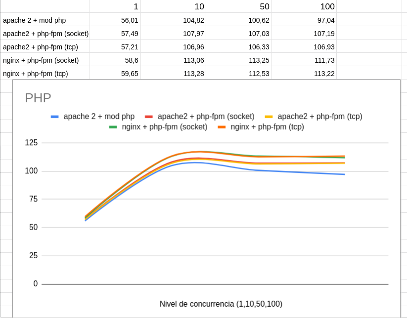

## PHP

Sabemos que tenemos 5 formas de ejecutar PHP:

* apache2 + módulo php
* PHP-FPM (socket unix) + apache2
* PHP-FPM (socket TCP) + apache2
* PHP-FPM (socket unix) + nginx
* PHP-FPM (socket TCP) + nginx

Hemos realizado varias pruebas de rendimiento con el comando ab sobre una página Wordpress. Se han hecho varias pruebas con distintos niveles de concurrencia, y hemos obtenida una media de peticiones por segundos, quedando los siguientes resultados:

Vemos que la opción que ofrece menos rendimiento es apache2 + módulo php, pero si realizar ninguna configuración especifica podemos determinar que las otras cuatros opciones ofrecen unos resultados similares. Podriamos concluir que el número de peticiones por segundo en ejecución de PHP va en un rango de 50 a 110, aproximadamente.

## Python

Vamos a comparar el rendimiento de distintas configuraciones de servidores web sirviendo páginas dinámicas programadas con Python, en concreto vamos a servir un CMS Mezzanine.

Las distintas configuraciones que hemos usado para ejecutar python son las siguientes:

    apache2 + Módulo wsgi
    apache2 + gunicorn
    apache2 + uwsgi
    nginx + gunicorn
    nginx + uwsgi

Y los resultados obtenidos son:

Podemos observar que la opción que más rendimiento ofrece es **nginx + uwsgi**.