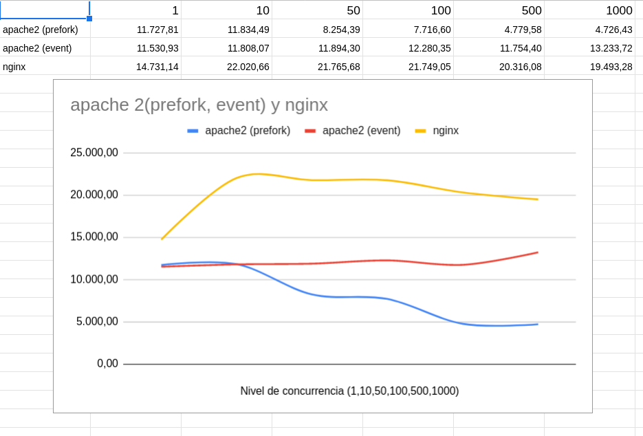

Si realizamos varias pruebas de rendimiento variando el número de peticiones concurrentes sobre un servidor web apache2 sirviendo una página estática con las distintas configuraciones de MPM y sobre un servidor nginx obtenemos el siguiente resultado:

Podemos concluir que nginx sirve más rapidamente páginas estáticas que apache2.