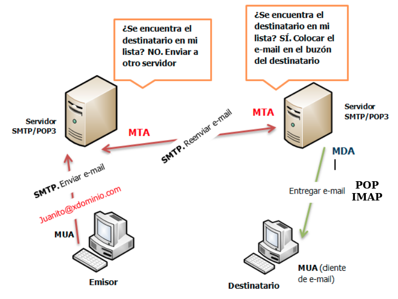

## Direcciones de correo electrónico

Para enviar un correo necesitamos la dirección de correo de un usuario, la forma de esta dirección es:

    usuario@nombre_servicio_correo

Normalmente el nombre del servicio de correo es el nombre del dominio de la organización a la que pertenece el usuario.

Cuando envíamos un correo a esa dirección, de alguna manera tenemos que determinar la dirección IP del servidor de correo de la organización:

1. Si el nombre detrás de la @ está asociado a un **registro A** en un servidor DNS, ya sabríamos la dirección del servidor de correo.
2. Como hemos comentado, el nombre del servicio de correo es un nombre de dominio que no suele estar asociado a una dirección IP (y menos del servidor de correo). Por lo tanto, es necesario en el servidor dns un **registro MX** que indique el nombre del servidor de correo asociado al nombre de dominio.

## Conceptos:

* **MUA**: Un MUA (Mail User Agent, Agente de usuario de correo) es un programa que permite a un usuario, como mínimo, leer y escribir mensajes de correo electrónico. A un MUA se le denomina a menudo cliente de correo.
* **MTA**: Un programa MTA (Mail Transfer Agent, Agente de transferencia de correo) transfiere los mensajes de correo electrónico entre máquinas que usan el protocolo SMTP. Un mensaje puede pasar por varios MTA hasta llegar al destino final. A un MTA se le denomina a menudo servidor de correo.
* **MDA**: Los agentes MTA utilizan programas MDA (Mail Delivery Agent, Agente de entrega de correo) para entregar el correo electrónico al buzón de un usuario concreto. Esta entrega se puede hacer localmente en el servidor (la realizarán programas llamados LDA (Local Delivery Agent, Agente de entrega local)), o la pueden hacer de forma remota utilizando el protocolo POP3 o IMAP.
* **SMTP**: El protocolo para transferencia simple de correo (en inglés Simple Mail Transfer Protocol o SMTP) es un protocolo de red utilizado para el intercambio de mensajes de correo electrónico. Existe una mejora del protocolo llamada ESMTP (Enhanced Simple Mail Transfer Protocol).
* **POP3**: Mail Delivery Agent [Agente de Entrega de Correo]. Protocolo para recuperar correos electrónicos de un MDA. Su principal característica es que se descargan todos los correos.
* **IMAP**: Internet Message Access Protocol [Protocolo de Acceso a Mensajes de Internet]. Prótocolo para recuperar correos electrónicos de un MDA. En este caso, se sincroniza el estado de los correos entre el servidor y el cliente.

## ¿Cómo mandamos y recuperamos un correo electrónico?




1. Un usuario utiliza un **MUA** para enviar el correo electrónico a su servidor de correos (**MTA**). Este envío se hace usando el protocolo SMTP. El nombre del servidor tendrá que estar definido en un servidor DNS, y en un principio usamos el puerto 25/TCP. Está conexión no está ni autentificada (no hay que indicar usuario/contraseña), ni cifrada. Ya veremos en la actualidad vamos a usar el protocolo ESMTP, que utiliza otro puerto (587/TCP) y permite la autentificación y el cifrado de la comunicación.
2. El **MTA** recibe el correo desde el **MUA**:
    * Si la dirección del destinatario del correo es la misma que la que controla este servidor: el correo no se envía a ningún **MTA** y se le da al MDA para que lo guarde en el buzón del usuario destinatario.
    * Si la dirección del destinatario es distinta que la que controla este servidor, el correo se mandará al **MTA** correspondiente a la dirección del destinatario, esto se puede hacer de dos formas:
        * Si, por cualquier razón el **MTA** no puede enviar el correo directamente al **MTA** destino, puede tener configurado un servidor **MTA** intermediario (**relay**). Le mandará este correo al **MTA** intermediario que será el responsable de enviarlo al destinatario final.
        * Si el **MTA** no tiene configurado un servidor relay, tendrá que averiguar la dirección IP del servidor correspondiente al nombre de correo del destinatario, normalmente haciendo una consulta MX al sistema DNS. Si reciba varios servidores de correo le intentará mandar el correo al más prioritario (el que tiene el número más pequeño).
3. Cuando el correo llega al **MTA** destino, se pasa el correo al **MDA** que lo guardará en el buzón del usuario destinatario.
4. El usuario destinatario usará una **MUA** para conectarse al servidor **MDA** y recuperar el correo:
    * Puede usar el protocolo **POP3**, por lo que se conectará al servidor POP3. Está conexión está autentificada (tendrá que indicar usuario/contraseña) y puede estar cifrada. El protocolo POP3 suele usar el puerto 110/TCP. Con este protocolo lo que hacemos es descargar todos los correos desde nuestro buzón remoto a nuestro **MUA**.
    * Puede usar el protocolo **IMAP**, por lo que se conectará al servidor IMAP. Está conexión está autentificada (tendrá que indicar usuario/contraseña) y puede estar cifrada. El protocolo IMAP suele usar el puerto 143/TCP. Con este protocolo lo que hacemos es sincronizar el estado de los correos desde nuestro buzón remoto a nuestro **MUA**. De tal manera que podemos acceder desde distintos **MUA** y obtenemos el mismo estado de los correos en todos ellos. Es imprescindible si vamos a usar un **MUA** que sea una aplicación web.

## Formato de los correos electrónicos

Aunque en un principio SMTP, sólo usaba caracteres ASCII para mandar los coreos, en la actualizada se utiliza [MIME](https://es.wikipedia.org/wiki/Multipurpose_Internet_Mail_Extensions), extensiones multipropósito de correo de internet, que determinan unas convenciones que nos permite enviar archivos a travesz de internet, entre otras cosas nos proporcionan:

* Texto en conjuntos de caracteres distintos de US-ASCII;
* Adjuntos que no son de tipo texto;
* Cuerpos de mensajes con múltiples partes (multi-part);

Veamos algunas cabeceras que nos encontramos en los mensajes de correo electrónico:

**Es importante, al leer las cabeceras de correo de un e-mail, saber que cualquier linea puede ser falsificada, y por lo tanto solo las lineas Received: que son generadas por el servidor de correo deberían ser completamente creídas.**

* **From**: Aquí se muestra de quien viene el mensaje, en cualquier caso, esta linea puede ser fácilmente modificada y sería la menos fidedigna.
* **Subject**: Esto es lo que el remitente coloca como un tema del contenido del correo electrónico, y que es comúnmente conocido como el “Asunto”.
* **Date**: En esta linea se muestra la fecha y hora en la que el mensaje fue compuesto.
* **To**: Esto demuestra a quien el mensaje iba dirigido, pero podría no contener la dirección del destinatario.
* **Cc**: Copia de carbón: identifica a los destinatarios secundarios del correo.
* **Bcc**: Copia de carbón oculta: identifica a los destinatarios ocultos del correo. La diferencia con el campo anterior es que este campo es eliminado por el servidor al transmitir el mensaje, con lo que el resto de destinatarios no saben de la existencia de estas copias ocultas.

Estas cabeceras son las que vemos al leer un correo electrónico de formal normal. Pero hay otras cabeceras que son añadidas por los servidores por donde pasa el correo:

* **Return-Path**: La cuenta de correo electrónico para devolver el correo. 
* **Delivered-To**: Usuario final en cuyo buzón se entrega el correo. Podría no coincidir con la dirección del campo To: si esta era una cuenta virtual.
* **Received**: Información por cada servidor de correo que ha pasado el correo. Hay que leerla 

Otras cabeceras:

* **MIME-Version**: La presencia de este encabezado indica que el mensaje utiliza el formato MIME. 
* **Content-Type**: Indica el tipo de medio que representa el contenido del mensaje. A través del uso del tipo multiparte (multipart), MIME da la posibilidad de crear mensajes que tengan partes y subpartes organizadas en una estructura arbórea en la que los nodos hoja pueden ser cualquier tipo de contenido no multiparte y los nodos que no son hojas pueden ser de cualquiera de las variedades de tipos multiparte. 

Las cabeceras no estándar empiezan por `X-`. 

Otras cabeceras referidas a la seguridad, la estudiaremos posteriormente, por ejemplo: **Received-SPF**, **DKIM-Signature**.

Ejemplo de mensaje de correo:

```
Delivered-To: josedom24@josedomingo.org
Received-SPF: pass (zohomail.com: domain of _spf.google.com designates 209.85.214.177 as permitted sender) client-ip=209.85.214.177; envelope-from=josedom24@gmail.com; helo=mail-pl1-f177.google.com;
Authentication-Results: mx.zohomail.com;
	dkim=pass;
	spf=pass (zohomail.com: domain of _spf.google.com designates 209.85.214.177 as permitted sender)  smtp.mailfrom=josedom24@gmail.com;
	dmarc=pass(p=none dis=none)  header.from=gmail.com
ARC-Seal: i=1; a=rsa-sha256; t=1610017641; cv=none; 
	d=zohomail.com; s=zohoarc; 
	b=jBmq0VnRDWXUcVfEQrJlH1YCt+ZwCPwLsYyh0eWYmNPtvQdPvQVMzdNF5dVMaWwm6uQCzN46tXbLb2hRMxqGy7W1LhP93za4+AKbjjWW2ArRsxUEaHgW2s4DMSwUppq+W7xKIebsxswXRcbWXOSwFa04xffiqy5porSca+RZiJA=
ARC-Message-Signature: i=1; a=rsa-sha256; c=relaxed/relaxed; d=zohomail.com; s=zohoarc; 
	t=1610017641; h=Content-Type:Date:From:MIME-Version:Message-ID:Subject:To; 
	bh=p9hWRGxz+0RHOpRPIVZivlRGXyuoz/Gpck/0wLYuacM=; 
	b=huGp69pcRSjcHSbpJLmBBRO3XBmb8f2FLlaoxBUwkh43scGcqsgw1oiyxR53n2PsPtkcfUazgNhZsr6mx+KKZRl3PxsyzJQMizasKVfvn7wpulaIJ0LegOg7CudID8PvEU4nPJ40cfCVO3w0Cpk7SPnO2sGSPDrfjkWVfNEpiV8=
ARC-Authentication-Results: i=1; mx.zohomail.com;
	dkim=pass;
	spf=pass (zohomail.com: domain of _spf.google.com designates 209.85.214.177 as permitted sender)  smtp.mailfrom=josedom24@gmail.com;
	dmarc=pass header.from=<josedom24@gmail.com> (p=none dis=none) header.from=<josedom24@gmail.com>
Return-Path: <josedom24@gmail.com>
Received: from mail-pl1-f177.google.com (mail-pl1-f177.google.com [209.85.214.177]) by mx.zohomail.com
	with SMTPS id 1610017641624795.9545948677358; Thu, 7 Jan 2021 03:07:21 -0800 (PST)
Received: by mail-pl1-f177.google.com with SMTP id j1so3316071pld.3
        for <josedom24@josedomingo.org>; Thu, 07 Jan 2021 03:07:21 -0800 (PST)
DKIM-Signature: v=1; a=rsa-sha256; c=relaxed/relaxed;
        d=gmail.com; s=20161025;
        h=mime-version:from:date:message-id:subject:to;
        bh=p9hWRGxz+0RHOpRPIVZivlRGXyuoz/Gpck/0wLYuacM=;
        b=D552SMH8FYUstsz22XK5UTdEH2LGh+LIVK2/U3rY+pqop/mjrXh905gsARGSK3sgLu
         mSFyScBW/+9ae1yQqcSVXH+/5xx5vrxErZJpXXnas1ziKRDHj1nb2VXvo/aCtGjaqid9
         Zz6NZqK8K67xZrJ3qaws66hF/MNlexHSF0lAuNj9MTSBagL02LHuhI/ObqLnLtygkUuL
         +KUY7fZqwthE79mWK+ALei5Tw3ttDTCbLrEIqmoOFArGp2SHndvh3C5MlDLKMwXZj9qJ
         lHH/Fi5NNIwLgr3Kqw9ljTnS6WcP9+WixXTZ/SJ8wxmk2C2DyFx2AMz4474+2KKVEVxF
         AuvQ==
X-Google-DKIM-Signature: v=1; a=rsa-sha256; c=relaxed/relaxed;
        d=1e100.net; s=20161025;
        h=x-gm-message-state:mime-version:from:date:message-id:subject:to;
        bh=p9hWRGxz+0RHOpRPIVZivlRGXyuoz/Gpck/0wLYuacM=;
        b=fERbI7BdRULBwil6C1TEDVt2/x2aG5FO1AZSqPGaDXgKvhkr7EnYrh6xoIxGfcRDBD
         /xjhCa5Wda9G9ikCA9Q/d4xd/f/NfGhywwCnpwbT2meZVKp5KwBGmXWnDQtc24PDuXD3
         v6JLGyeMeErFtjPawRcvWGIh9hRPzjfahvZWf8ZC7CSfEX5nebaVK5bHKCobBHrm3QNA
         6inF2o3Oe6kKzY9UPKNUPhV9vnMjVQ+B6Mu0NVu7Ywn7AjaccP16AlHxzjUi0Gh0tkgG
         PCCSUM6dh1pnvrRNME4Ll7ZXGc0lv0bNYbJ6h6/xvk5NjYkE59+LBv7yp+a/HCxs3ReE
         DVzw==
X-Gm-Message-State: AOAM531dH32SPfexRbOO7Y7mHum0bmj62TWCmlqq7RnBi4ZQl/LOLhQX
	LmFD9CadqdHkBMya1zZZFYjLt2aHi/AAgx4tRLzCxmB0VcM=
X-Google-Smtp-Source: ABdhPJxj+sqysCLk7UL+T36MknycJ7AV7C0LRh/r/mmV5DZCGwKniqCFaQTZw1hcBI+j10rE+jmCSy0EXY9eSZQHrvM=
X-Received: by 2002:a17:902:c244:b029:da:e63c:cede with SMTP id
 4-20020a170902c244b02900dae63ccedemr8552867plg.0.1610017640564; Thu, 07 Jan
 2021 03:07:20 -0800 (PST)
MIME-Version: 1.0
From: =?UTF-8?Q?Jose_Domingo_Mu=C3=B1oz?= <josedom24@gmail.com>
Date: Thu, 7 Jan 2021 12:07:08 +0100
Message-ID: <CAP3_uww40XeDoRSmTAhe1cXB3McWQDtXiw1Shjxqt-CAR0v4=w@mail.gmail.com>
Subject: =?UTF-8?Q?Prueba_de_env=C3=ADo?=
To: josedom24@josedomingo.org
Content-Type: multipart/mixed; boundary="0000000000008c715f05b84d710c"
X-Zoho-Virus-Status: 1
X-ZohoMail-DKIM: pass (identity @gmail.com)


--0000000000008c715f05b84d710c
Content-Type: multipart/alternative; boundary="0000000000008c715c05b84d710a"

--0000000000008c715c05b84d710a
Content-Type: text/plain; charset="UTF-8"
Content-Transfer-Encoding: quoted-printable

Hola, =C2=BFC=C3=B1omo va?
Adjunto un pdf.
--=20
Jos=C3=A9 Domingo Mu=C3=B1oz Rodr=C3=ADguez

--0000000000008c715c05b84d710a
Content-Type: text/html; charset="UTF-8"
Content-Transfer-Encoding: quoted-printable

<div dir=3D"ltr"><div><br clear=3D"all"></div><div>Hola, =C2=BFC=C3=B1omo v=
a?</div><div>Adjunto un pdf.<br></div><div>-- <br><div dir=3D"ltr" class=3D=
"gmail_signature" data-smartmail=3D"gmail_signature">Jos=C3=A9 Domingo Mu=
=C3=B1oz Rodr=C3=ADguez</div></div></div>

--0000000000008c715c05b84d710a--
--0000000000008c715f05b84d710c
Content-Type: application/pdf; name="documento.pdf"
Content-Disposition: attachment; filename="documento.pdf"
Content-Transfer-Encoding: base64
Content-ID: <f_kjmqxb850>
X-Attachment-Id: f_kjmqxb850

JVBERi0xLjUKJcOkw7zDtsOfCjIgMCBvYmoKPDwvTGVuZ3RoIDMgMCBSL0ZpbHRlci9GbGF0ZURl
Y29kZT4+CnN0cmVhbQp4nCXKuwqDQBBG4X6e4q8DmcyMrjsLsoWQFHbCgEVIl0sX0MbXV5BTfM0R
Vmy0QCAs5kglseUEb5W9U6wfmi/4n8fR+qMhKHXsyLnh4gXxxu2hUEN8n71ovVovJk09aOsrRroH
TTRhB9DOFv4KZW5kc3RyZWFtCmVuZG9iagoKMyAwIG9iagoxMDgKZW5kb2JqCgo1IDAgb2JqCjw8
L0xlbmd0aCA2IDAgUi9GaWx0ZXIvRmxhdGVEZWNvZGUvTGVuZ3RoMSA4MTcyPj4Kc3RyZWFtCnic
...
--0000000000008c715f05b84d710c--
```