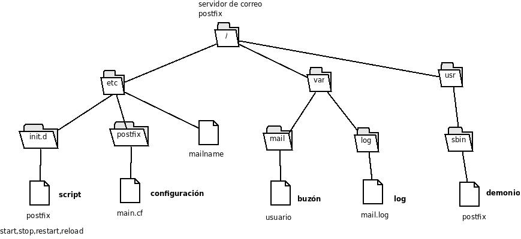

## Instalación de postfix

    apt install postfix

* Tipo de servidor: Internet Site (vamos a recibir y enviar correo directamente)
* Mailname: DOMINIO

## Directivas de configuración

Revisemos las directivas a tener en cuenta en nuestra configuración (``/etc/postfix/main.cf``):

* ``mydestination``: Observa que en la directiva ``mydestination`` se indican los dominios que serán propios del servidor de correo, es decir, el correo envíado a estos dominios está dirigirido a usuarios del propio servidor. Si el usuario existe, el mensaje será almacenado, sino el servidor devolverá un mensaje de error. Por defecto aparece entre otros: DOMINIO, HOSTNAME, localhost
* ``relay_domains``: Con la directiva ``relay_domains`` indicamos los dominios que serán reenviados. Por lo tanto se permitirán el envío de correos a usuarios de estos dominios.
* ``mynetworks``: Con ``mynetworks`` se indican las IPs desde las que pueden enviarse mensajes.
* ``myorigin``: Por último, con ``myorigin`` se indica el dominio con el que el servidor enviará correo, el cual está configurado en ``/etc/mailname``. Por defecto: `127.0.0.0/8 [::ffff:127.0.0.0]/104 [::1]/128`

## Localización de los ficheros del servidor postfix

