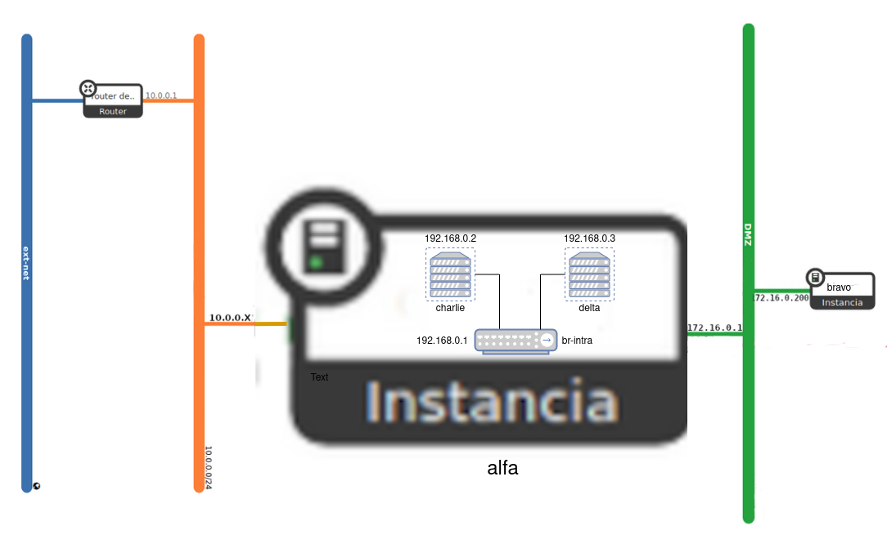

En esta tarea se va a crear el escenario de trabajo que se va a usar durante todo el curso, que va a constar inicialmente de 4 máquinas: 2 instancias en OpenStack y dos contenedores LXC que se ejecutarán en una de las instancias.

## Escenario

## Instalación de las instancias de OpenStack

1. Crea una red interna que se llame **Red DMZ de tu_usuario**, con las siguientes características:
	* Direccionamiento: 172.16.0.0/16
	* Con DHCP y DNS (`192.128.202.2`).
	* La puerta de enlace de los dispositivos conectados a esta red será el `172.16.0.1`.
2. Las dos instancias que vamos a crear se van a configurar con `cloud-init` de la siguiente manera:
	* Deben actualizar los paquetes de la distribución de la instancia.
	* El dominio utilizado será del tipo `tunombre.gonzalonazareno.org`. Por lo tanto en la configuración con `cloud-init` habrá que indicar el hostname y el FQDN.
	* Se crearán dos usuarios: 
		* Un usuario sin privilegios. Se puede llamar como quieras (pero el nombre será el mismo en todas las máquinas) y accederás a las máquinas usando tu clave ssh privada.
		* Un usuario `profesor`, que puede utilizar `sudo` sin contraseña. Copia de las claves públicas de todos los profesores en las instancias para que puedan acceder con el usuario `profesor`.
	* Cambia la contraseña al usuario `root`.
3. Creación de la **máquina1**:
	* Crea una instancia sobre un volumen de 40Gb, usando una imagen de Debian 11. Elige el sabor `vol.normal`. Y configuralá con `cloud-init` como se ha indicado anteriormente.
	* Está instancia estará conectada a tu red interna. Asigna a la instancia una IP flotante.
4. Configuración de la **máquina1**:
	* Conecta la instancia a tu **Red DMZ**, usando un puerto, asígnale la dirección `172.16.0.1` para que sea la puerta de enlace las máquinas conectadas a esta red.
	* Deshabilita la seguridad de los puertos en las dos interfaces de red para que funcione de manera adecuada el NAT.
	* Configura de forma permanente la regla SNAT para que las máquinas de la **Red DMZ** tengan acceso a internet.
5. Creación de la **máquina2**:
	* Está instancia se conectará a la **red DMZ**. Usando un puerto asigna a esta máquina la dirección `172.16.0.200`.
	* Crea una instancia sobre un vollumen de 40Gb, usando una imagen de Rocky Linux 9. Elige el sabor `vol.normal`. Y configuralá con `cloud-init` como se ha indicado anteriormente.
	* Deshabilita la seguridad de los puertos en la interfaz de red para que funcione de manera adecuada el NAT.
	* Comprueba que tiene acceso a internet. **Si no tiene acceso a internet, no se han actualizado los paquetes con cloud-init, hazlo posteriormente.**.

## Instalación de los contenedores

En **maquina1** vamos a crear dos contenedores en un red interna, para ello:
1. Crea en **máquina1** un linux bridge llamado `br-intra` y asigna una dirección IP estática `192.168.0.1`. Esta será la IP de **máquina1** conectada a este switch virtual y será la puerta de enlace de los contenedores.
2. Instala LXC y crea dos contenedores con la distribución Ubuntu 20.04. Estos contenedores serán la **máquina3** y la **máquina4**.
3. Configura de forma permanente la regla SNAT para que los contenedores tengan acceso a internet.
4. Conecta los contenedores al bridge `br-intra` y configúralo de forma estática con las siguientes direcciones: **máquina3** la `192.168.0.2` y **máquina4** la `192.168.0.3`.
5. Para que la red de OpenStack funcione de forma adecuada las imágenes que usamos tienen configurado la mtu (*Unidad máxima de transferencia*) a 1450 bytes. Tenemos que adecuar los contenedores a este tamaño de trama. Para ello introduce en la configuración de los contenedores la línea: `lxc.net.0.mtu = 1450`.
6. Confiigura los contenedores para que se auto inicien al reiniciar la instancia. 
7. Los contenedores tendrán características parecidas a las instancias anteriormente:
	* Deben actualizar los paquetes de la distribución instalada.
	* El dominio utilizado será del tipo `tunombre.gonzalonazareno.org`. Por lo tanto configura de manera adecuda el hostname y el FQDN.
	* Para acceder a los contenedores vamos a usar ssh.
	* Crea dos usuarios: 
		* Un usuario sin privilegios. Se puede llamar como quieras (el nombre de usuario que usaste en las instancias) y accederás a los contenedores usando tu clave ssh privada.
		* Un usuario `profesor`, que puede utilizar `sudo` sin contraseña. Copia de las claves públicas de todos los profesores en los contenedores para que puedan acceder con el usuario `profesor`.
	* Cambia la contraseña al usuario `root`.

## Entrega


{{ notice-text | markdownify }}

